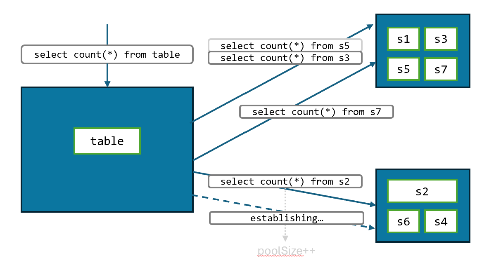
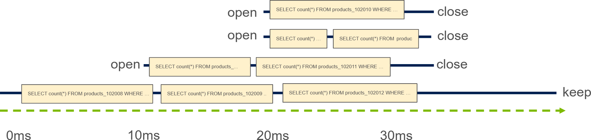
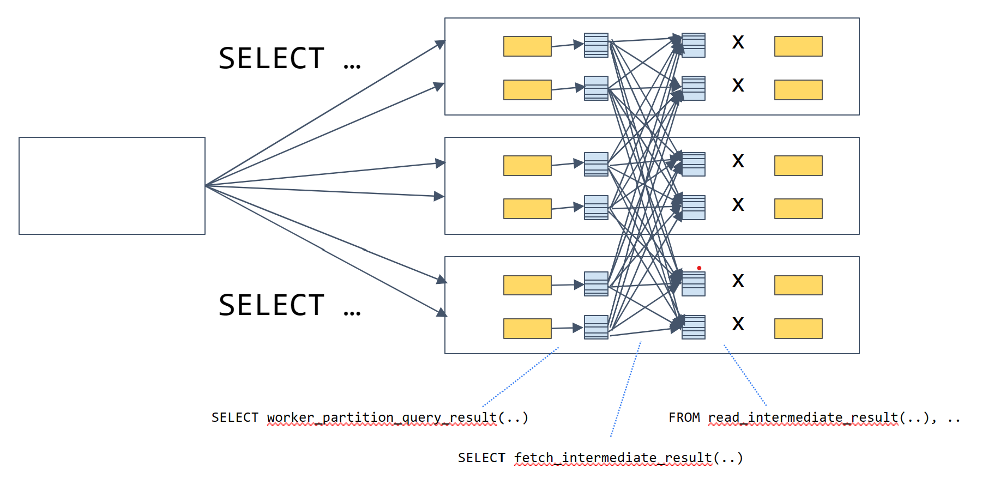
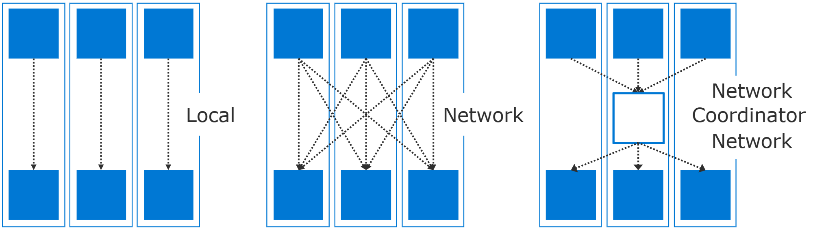
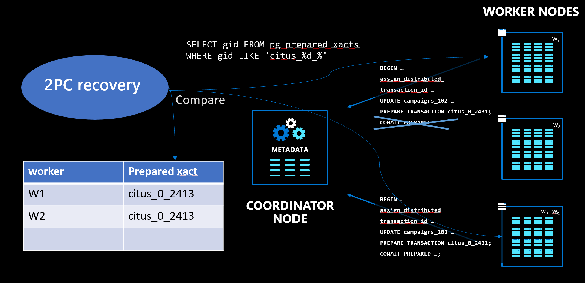
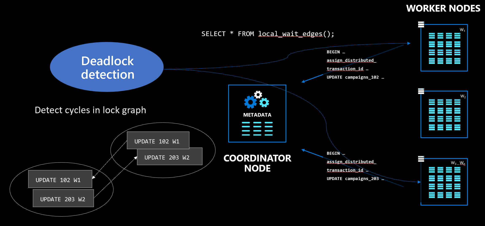
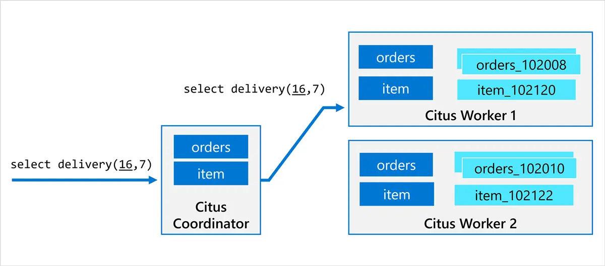
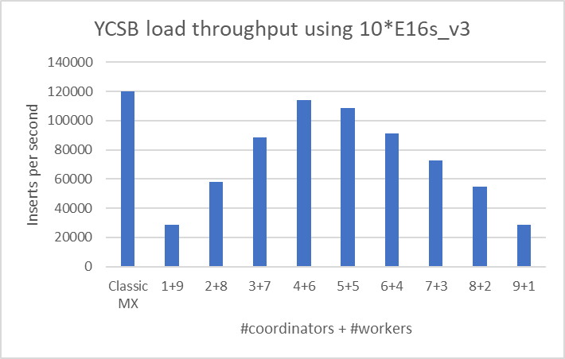

 <!--- we use Github's href convention in Table of Content --->
# Citus Technical Documentation

The purpose of this document is to provide comprehensive technical documentation for Citus, in particular the distributed database implementation.

# Table of Contents
- [Citus Concepts](#citus-concepts)
  - [Principles](#principles)
- [Use of hooks](#use-of-hooks)
- [Query planner](#query-planner)
  - [High-level design/flow:](#high-level-designflow)
  - [Distributed Query Planning with Examples in Citus (as of Citus 12.1)](#distributed-query-planning-with-examples-in-citus-as-of-citus-121)
  - [Logical Planner & Optimizer](#logical-planner--optimizer)
  - [Combine query planner](#combine-query-planner)
  - [Restriction Equivalence](#restriction-equivalence)
  - [Recurring Tuples](#recurring-tuples)
- [Executor](#executor)
  - [Custom scan](#custom-scan)
  - [Function evaluation](#function-evaluation)
  - [Prepared statements](#prepared-statements)
  - [Adaptive executor](#adaptive-executor)
  - [Local execution](#local-execution)
  - [Subplans](#subplans)
  - [Re-partitioning](#re-partitioning)
  - [COPY .. FROM command](#copy--from-command)
  - [COPY .. TO command](#copy--to-command)
  - [INSERT..SELECT](#insertselect)
  - [Merge command](#merge-command)
- [DDL](#ddl)
  - [Object & dependency propagation](#object--dependency-propagation)
  - [Foreign keys](#foreign-keys)
  - [DROP Table](#drop-table)
- [Connection management](#connection-management)
  - [Connection management](#connection-management-1)
  - [Placement connection tracking](#placement-connection-tracking)
  - [citus.max_cached_connections_per_worker](#citusmax_cached_connections_per_worker)
  - [citus.max_shared_pool_size](#citusmax_shared_pool_size)
- [Transactions (2PC)](#transactions-2pc)
  - [Single-node transactions](#single-node-transactions)
  - [Multi-node transactions](#multi-node-transactions)
  - [No distributed snapshot isolation](#no-distributed-snapshot-isolation)
  - [Distributed Deadlocks](#distributed-deadlocks)
- [Locking](#locking)
  - [Lock Levels](#lock-levels)
  - [Lock Monitoring](#lock-monitoring)
  - [Lock Types](#lock-types)
- [Rebalancing](#rebalancing)
  - [Rebalancing algorithm](#rebalancing-algorithm)
  - [Shard moves](#shard-moves)
  - [Shard splits](#shard-splits)
  - [Background task runner](#background-task-runner)
  - [Resource cleanup](#resource-cleanup)
- [Logical decoding / CDC](#logical-decoding--cdc)
  - [CDC ordering](#cdc-ordering)
- [Global PID](#global-pid)
- [Function call delegation](#function-call-delegation)
- [Query from any node](#query-from-any-node)
  - [Why didn’t we have dedicated Query Nodes and Data Nodes?](#why-didnt-we-have-dedicated-query-nodes-and-data-nodes)
  - [Shard visibility](#shard-visibility)
- [Statistic tracking](#statistic-tracking)
  - [Citus stat counters](#citus-stat-counters)

# Citus Concepts

**Citus table**: A table managed by Citus through PostgreSQL hooks. Whenever the table is involved in a command, the command is handled by Citus.

**Shell table**: The “original” (inaccessible) PostgreSQL table which has been converted to a Citus table. Every node has shell tables and the corresponding Citus metadata.

**Metadata**: The Citus catalog tables, shell tables, and dependent objects that are replicated to all nodes to enable distributed queries from those nodes.

**Metadata syncing**: The process of replicating metadata from the coordinator to other nodes, which happens when adding a node or any change to the metadata.

There are several types of Citus tables:

**Distributed tables** are created using `SELECT create_distributed_table('table_name', 'distribution_column')`. They have a distribution column and for each row the value in the distribution column determines to which shard the row is assigned. There are 3 different partitioning schemes for distributed tables, though only the first is supported:

- Hash-distributed tables have a range of hash values in shardminvalue/shardmaxvalue in pg_dist_shard
- Range-distributed tables (deprecated) have shards with a distinct range of values in pg_dist_shard
- Append-distributed tables (deprecated) have shards with a range of values in pg_dist_shard, though the ranges can overlap.

Hash-distributed tables can be **co-located** with each other, such that the shards with the same hash value range are always on the same node. From the planner point-of-view, range-distributed tables can also be colocated, but shards are not managed by Citus.

Shards can be replicated (deprecated), in which case they have multiple shard placements. Writes to the placements are performed using 2PC and use aggressive locking to avoid diverging.

**Reference tables** are created using SELECT create_reference_table(..). They have a single shard, which is replicated to all nodes. It is possible to have a node without reference table replicas, but in that case the reference tables are replicated before the next rebalance. Reference tables are always co-located with each other and have a common co-location ID.

Writes to a reference table are performed using 2PC and use aggressive locking to avoid diverging.

**Single shard tables** are a special type of distributed table without a distribution column and with a single shard. When using schema-based sharding, tables created in a distributed schema automatically become single shard tables. Single shard tables can be co-located with each other, but not replicated. Single shard tables can be explicitly created using `SELECT create_distributed_table('table_name', NULL);`, though are meant to be auto-generated by schema-based sharding.

**Citus local tables**: A single shard table that can only be placed on the coordinator and are primarily used as a drop-in replacement for regular PostgreSQL tables when creating foreign keys to/from reference tables. All Citus local tables are implicitly co-located with each other, but do not have a co-location ID. Citus local tables can be explicitly created using `SELECT citus_add_local_table_to_metadata('table_name');`, though are meant to be auto-generated by foreign keys.

All Citus table types have the notion of a “shard”, though in many cases there is only a single shard.

**Shard**: The table that contains the actual data in a Citus table. Shards reside in the same schema as the Citus table and are named after the Citus table with the shard ID as a suffix. Shards are hidden from catalog queries unless you SET citus.override_table_visibility TO off. Hash-distributed tables have multiple shards, each of which has distinct shardminvalue/shardmaxvalue.

**Colocation group**: A set of distributed tables that have the same co-location ID, such that their shards are always co-located.

**Shard group**: A set of shards with the same shardminvalue/shardmaxvalue that are part of the same co-location group. Citus guarantees that shards from the same shard group are always placed on the same node group.

**Shard placement**: The assignment of a shard to a node group. There can be multiple placements of the same shard if the table is replicated (e.g. reference tables).

**Shard group placement**: The assignment of a shard to a node group must be the same for all shards in a shard group, since those are always co-located. We’ll refer to the group of placements of a shard group as a shard group placement.

**Node**: A single PostgreSQL/Citus server listed in pg_dist_node and added via SELECT citus_add_node(..).

**Node group**: Each primary node can have 0 or more physical replicas in read replica clusters. Together the nodes form a node group identified by the groupid in pg_dist_node. Per convention, the coordinator(s) have group ID 0. Each node can know its own node groupid by reading it from pg_dist_local_group.

**Coordinator**: The node with groupid 0, which can perform reads, writes, and administrative operations such as adding a node, rebalancing, and schema changes.

**Worker nodes**: Nodes with groupid > 0, which can perform reads and writes, but not administrative operations.

**Cluster**: The combination of worker nodes and coordinator is a cluster. When the cluster has a read replica, the nodes in the read replica are listed in pg_dist_node with a different nodecluster value, and the servers have a corresponding citus.cluster_name in their postgresql.conf. That way, nodes know which other nodes in pg_dist_node belong to their cluster, and they will ignore others.

**Read replica cluster**: In a read replica cluster, every node is a physical replica of a node in a primary Citus cluster. The read replica has a distinct citus.cluster_name value and the nodes in the read replica cluster should be added to pg_dist_node on the primary coordinator with the corresponding cluster name.

**Client connections**: Connections made by the client to any of the nodes in the cluster. Each client connection is backed by a postgres process/backend, which we sometimes refer to as a client session.

**Internal connections**: Connections to other nodes made by a command running on a client session. Each internal connection is backed by a process, which we sometimes refer to as an internal session. In the code, you can use IsCitusInternalBackend()

**Maintenance daemon**: A background worker that is started in each database that has the Citus extension. It performs distributed deadlock detection, 2PC recovery, synchronizing node metadata after citus_update_node, resource cleanup, and other tasks.

In the query planner, we use the following terminology:

**Distributed query**: A query sent by the client that involves a Citus table and is therefore handled by the distributed query planner.

**Shard query**: An internal query on shards (at most 1 shard group).

**Intermediate result**: A temporary file that contains the result of a subquery or CTE, created as a result of a broadcast or repartition operation. Intermediate results are automatically cleaned up on transaction end or restart.

## Principles

Use cases:

- Multi-tenant apps are the primary use case for Citus, which we can scale through distributing and co-locating by tenant ID, or through schema-based sharding. Citus is reasonably complete for this use case, but there are still SQL and operational improvements that can be made.
- Real-time analytics is another popular use case due the combination of parallel distributed queries with indexes & in-database materialization (ETL). Improvement areas include automated time partitioning, better columnar storage (perf and update/delete), and incremental materialized views.
- Citus works well for CRUD use cases, but would be far easier to use if we introduced a load balancer, DDL from any node (no explicit coordinator), and by better use of connection pooling for better performance (e.g. outbound pgbouncers).
- Marketplace use cases could work well if we made it easier to distribute tables twice by different dimensions or made it easier to keep paired tables in sync.

Schema management:

 - Our goal is for all DDL commands on Citus tables to work transparently, and for global DDL commands (e.g. CREATE TYPE) to be propagated to all nodes. Not all DDL is implemented yet and may either error or not propagate.
 - Since we cannot define custom DDL commands for sharding operations, we use functions that are called from a SELECT query.

Query layer:

- No incompatibilities with PostgreSQL – any query on a Citus table is supported on an equivalent PostgreSQL table.
- We optimize for maximum pushdown (& performance) over complete compatibility, but our long-term goal is for all queries to be supported in all cases.
- For single-shard queries, it is useful to avoid detailed query analysis through the fast path  planner (simple, single table) and router planner (co-located joins) layers. However, multi-shard queries can go through disparate code paths that were added out of expediency and should eventually be unified.

Transactional semantics:

- Transactions scoped to a single node follow the same semantics as PostgreSQL.
- Transactions across nodes are atomic, durable, and consistent, but do not have full snapshot isolation: A multi-shard query may see a concurrently committing transaction as committed on one node, but not yet committed on another node.
- Read-your-writes consistency should be preserved.
- Monotonic read consistency should be preserved for tables without replication, may not always be the case for replicated/reference tables.

Replication model:

- High availability is achieved through hot standby nodes managed by a control plane or PostgreSQL HA solution like Patroni or pg_auto_failover.
- Read replicas are Citus clusters in which each node is a physical replica of a node in another Citus cluster.
- Hot standby nodes are, at the time of writing, not in the metadata. Instead, the hostname/IP is replaced or rerouted at failover time.
- The deprecated “statement based” replication is (as of Citus 11.0+) only useful for providing read scalability, not for HA as all modifications are done via 2PC. Reference tables do use statement-based replication.

# Use of hooks

A PostgreSQL extension consists of two parts: a set of SQL objects (e.g. metadata tables, functions, types) and a shared library that is loaded into PostgreSQL and can alter the behavior of PostgreSQL by setting certain hooks. You can find a high-level description of these concepts in [this talk](https://learn.microsoft.com/en-us/events/azure-cosmos-db-liftoff/foundations-of-distributed-postgresql-with-citus).

Citus uses the following hooks:

**User-defined functions (UDFs)** are callable from SQL queries as part of a transaction, but have an implementation in C, and are primarily used to manipulate the Citus metadata and implement remote procedure calls between servers.

**Planner and executor hooks** are global function pointers that allow an extension to provide an alternative query plan and execution method. After PostgreSQL parses a query, Citus checks if the query involves a Citus table. If so, Citus generates a plan tree that contains a CustomScan operator, which encapsulates distributed query plan.

**CustomScan** is an operator in a PostgreSQL query plan that returns tuples via custom function pointers. The Citus CustomScan calls the distributed query executor, which sends queries to other servers and collects the results before returning them to the PostgreSQL executor.

**Transaction callbacks** are called at critical points in the lifecycle of a transaction (e.g. pre-commit, post-commit, abort). Citus uses these to implement distributed transactions.

**Utility hook** is called after parsing any command that does not go through the regular query planner. Citus uses this hook primarily to apply DDL and COPY commands that affect Citus tables.

**Background workers** run user-supplied code in separate processes. Citus uses this API to run a maintenance daemon. This daemon performs distributed deadlock detection, 2PC prepared transaction recovery, and cleanup.

Through these hooks, Citus can intercept any interaction between the client and the PostgreSQL engine that involves Citus tables. Citus can then replace or augment PostgreSQL's behavior.

# Query planner

Citus has a layered planner architecture that accommodates different workloads. There are several useful presentations/papers that are relevant to Citus’ distributed planner, below we try to categorize them:

## High-level design/flow:

- Distributing Queries the Citus Way: Marco’s PG Con presentation provides a good introduction: https://postgresconf.org/system/events/document/000/000/233/Distributing_Queries_the_Citus_Way.pdf

- Another useful content on this topic is the Planner README.md: https://github.com/citusdata/citus/blob/main/src/backend/distributed/planner/README.md

- Onder’s talk at CitusCon: https://www.youtube.com/watch?v=raw3Pwv0jb8
- Citus paper: https://dl.acm.org/doi/pdf/10.1145/3448016.3457551

- Logical planner design - 1: https://speakerdeck.com/marcocitus/scaling-out-postgre-sql

- Logical Planner design - 2: https://www.youtube.com/watch?v=xJghcPs0ibQ

- Logical Planner based on the paper: Correctness of query execution strategies in distributed databases: https://dl.acm.org/doi/pdf/10.1145/319996.320009

##  Distributed Query Planning with Examples in Citus (as of Citus 12.1)

This part of the documentation aims to provide a comprehensive understanding of how Citus handles distributed query planning with examples. We will use a set of realistic tables to demonstrate various queries. Through these examples, we hope to offer a step-by-step guide on how Citus chooses to plan queries.

Citus hooks into the PostgreSQL planner using the top-level planner_hook function pointer, which sees the query tree after parsing and analysis. If the query tree contains a Citus table, we go through several planner stages: fast path planner, router planner, recursive planning, logical planner & optimizer. Each stage can handle more complex queries than the previous, but also comes with more overhead. That way, we can handle a mixture of high throughput transactional workloads (without adding significant planning overhead), as well as more complex analytical queries (with more sophisticated distributed query execution). For specific types of queries (e.g. insert..select), we have separate planner code paths.

For a more comprehensive high-level overview of the planner, go to https://postgresconf.org/system/events/document/000/000/233/Distributing_Queries_the_Citus_Way.pdf

### Table definitions used in this section

```sql
-- Distributed Table: Users Table
CREATE TABLE users_table (
    user_id bigserial PRIMARY KEY,
    username VARCHAR(50) NOT NULL,
    email VARCHAR(50),
    date_of_birth DATE,
    country_code VARCHAR(3)
);
SELECT create_distributed_table('users_table', 'user_id');

-- Distributed Table: Orders Table
CREATE TABLE orders_table (
    order_id bigserial,
    user_id BIGINT REFERENCES users_table(user_id),
    product_id BIGINT,
    order_date TIMESTAMPTZ,
    status VARCHAR(20)
);
SELECT create_distributed_table('orders_table', 'user_id');


-- Distributed Table: Products Table
CREATE TABLE products_table (
    product_id bigserial PRIMARY KEY,
    product_name VARCHAR(100),
    category_id INT,
    price NUMERIC(10, 2)
);
SELECT create_distributed_table('products_table', 'product_id');

-- Reference Table: Country Codes
CREATE TABLE country_codes (
    country_code VARCHAR(3) PRIMARY KEY,
    country_name VARCHAR(50)
);
SELECT create_reference_table('country_codes');

-- Reference Table: Order Status
CREATE TABLE order_status (
    status VARCHAR(20) PRIMARY KEY,
    description TEXT
);
SELECT create_reference_table('order_status');

-- Reference Table: Product Categories
CREATE TABLE product_categories (
    category_id INT PRIMARY KEY,
    category_name VARCHAR(50)
);
SELECT create_reference_table('product_categories');
```

## Fast Path Router Planner

The Fast Path Router Planner is specialized in optimizing queries that are both simple in structure and certain to touch a single shard. Importantly, it targets queries on a single shard distributed, citus local or reference tables. This does not mean the planner is restricted to trivial queries; it can handle complex SQL constructs like `GROUP BY`, `HAVING`, `DISTINCT`, etc., as long as these operate on a single table and involve an equality condition on the distribution key (`distribution_key = X`). The main SQL limitation for fast path distributed query planning is the subquery/CTE support. Those are left to the next planner: Router planner.

The aim of this planner is to avoid relying on PostgreSQL's standard_planner() for planning, which performs unnecessary computations like cost estimation, irrelevant for distributed planning. Skipping the standard_planner has significant performance gains for OLTP workloads. By focusing on "shard-reachable" queries, the Fast Path Router Planner is able to bypass the need for more computationally expensive planning processes, thereby accelerating query execution.

### Main C Functions Involved:

- `FastPathPlanner()`: The primary function for creating the fast-path query plan.
- `FastPathRouterQuery()`: Validates if a query is eligible for fast-path routing by checking its structure and the WHERE clause.

With  set client_min_messages to debug4; you should see the following in the DEBUG messages: "DEBUG:  Distributed planning for a fast-path router query"

```sql
-- Fetches the count of users born in the same year, but only
-- for a single country, with a filter on the distribution column
-- Normally we have a single user with id = 15 because it's a PRIMARY KEY
-- this is just to demonstrate that fast-path can handle complex queries
-- with EXTRACT(), COUNT(), GROUP BY, HAVING, etc.
SELECT EXTRACT(YEAR FROM date_of_birth) as birth_year, COUNT(*)
FROM users_table
WHERE country_code = 'USA' AND user_id = 15
GROUP BY birth_year
HAVING COUNT(*) > 10;
```

```sql
-- all INSERT commands are by definition fast path
-- router queries in the sense that they do not
-- need any information from Postgres' standard_planner()
INSERT INTO orders_table (user_id, product_id, order_date, status)
VALUES (42, 555, now(), 'NEW');
```

```sql
-- UPDATE/DELETEs can also be qualified as fast path router
-- queries
UPDATE products_table SET price = price * 1.1 WHERE product_id = 555;
```

Fast path queries have another important characteristic named "deferredPruning."

For regular queries, Citus does the shard pruning during the planning phase, meaning that the shards that the query touches are calculated during the planning phase. However, in an ideal world, the shard pruning should happen during the execution and, for a certain class of queries, we support that. In the code, that is denoted by "Job->deferredPruning" field.

Given that fast path queries are performance critical, they can be planned with prepared statements. When this is done, "Job->deferredPruning" becomes "true". And, the meaning of that is Citus can support PREPARED statements as expected. The first 6 executions of the plan do distributed planning, the rest is cached similar to Postgres' plan caching, and the shard pruning is done during the execution phase. And, if you attach a debugger, you'd see that on the first 6 executions, the debugger will stop at distributed_planner() function, but on the rest, it will not. The shard pruning for the cached command will happen in CitusBeginScan() function.

To see that in action, checkout the DEBUG messages:

```sql
set client_min_messages to debug4;
PREPARE p1 (bigint) AS SELECT * FROM users_table WHERE user_id = $1;

-- 1st execute
execute p1(1);
DEBUG:  Deferred pruning for a fast-path router query
DEBUG:  Creating router plan
....
(0 rows)

-- 2nd execute
execute p1(1);
DEBUG:  Deferred pruning for a fast-path router query
DEBUG:  Creating router plan
....
(0 rows)
...
execute p1(1);
execute p1(1);
execute p1(1);
...

-- 6th execute
execute p1(1);
DEBUG:  Deferred pruning for a fast-path router query
DEBUG:  Creating router plan
....
(0 rows)

-- now, on the 7th execute, you would **NOT** see the fast-path
-- planning anymore, because the query comes from Postgres'
-- query cache
execute p1(1);
DEBUG:  constraint value: '1'::bigint
DEBUG:  shard count after pruning for users_table: 1
DEBUG:  opening 1 new connections to localhost:9702
DEBUG:  established connection to localhost:9702 for session 8 in 9499 microseconds
DEBUG:  task execution (0) for placement (46) on anchor shard (102049) finished in 1281 microseconds on worker node localhost:9702
DEBUG:  Total number of commands sent over the session 8: 1 to node localhost:9702
(0 rows)
```


## Router Planner in Citus

### Overview

The Router Planner plays a key role in Citus' query optimization landscape. While sharing some common traits with the Fast Path Router Planner, it offers unique capabilities as well. Router (and fast path router) planners are the bedrock for the multi-tenant use cases.

#### Similarities with Fast Path Router Planner

- **Single Node Routing**: Both planners send queries to a single node. Unlike the Fast Path Planner, the Router Planner can work with multiple colocated tables, provided they have filters on their distribution columns.

- **Query Routing Mechanics**: Router Planner takes the query, verifies if it can be routed, and if so, it replaces original table names with their corresponding shard names, directing the query to the appropriate nodes.

#### Differences

- **Subqueries and CTEs**: The Router Planner can manage subqueries and Common Table Expressions (CTEs), routing the entire query to a single node as long as all involved tables have filters on their distribution columns.

- **Standard Planner Reliance**: Router Planner relies on PostgreSQL's `standard_planner()` to learn the necessary filter restrictions on the tables.

#### Main C Functions Involved

- `PlanRouterQuery()`: Responsible for creating the router plan.
- `TargetShardIntervalsForRestrictInfo()`: Retrieves the shard intervals based on restrictions provided by PostgreSQL's `standard_planner()`.

### Example Router Planner Queries

```sql
-- Fetch user data and their respective orders for a given user_id
SELECT u.username, o.order_id
FROM users_table u, orders_table o
WHERE u.user_id = o.user_id AND u.user_id = 42;

-- With Subqueries:
-- Fetch the username and their total order amount
-- for a specific user
SELECT u.username,
       (SELECT COUNT(*) FROM orders_table o
        WHERE o.user_id = 42 AND
        o.user_id = u.user_id)
FROM users_table u
WHERE u.user_id = 42;

-- Router planner works with CTEs (and UPDATE/DELETE Query):
-- Update the status of the most recent order for a specific user
WITH RecentOrder AS (
  SELECT MAX(order_id) as last_order_id
  FROM orders_table
  WHERE user_id = 42
)
UPDATE orders_table
SET status = 'COMPLETED'
FROM RecentOrder
WHERE orders_table.user_id = 42 AND
		orders_table.order_id = RecentOrder.last_order_id;
```


## Query Pushdown Planning in Citus

### Overview

While Router and Fast-Path Router Planners are proficient at dealing with single-shard commands—making them ideal for multi-tenant and OLTP applications—Citus also excels in analytical use-cases. In these scenarios, a single query is broken down into multiple parallel sub-queries, which are run on various shards across multiple machines, thereby speeding up query execution times significantly.

#### What is Query Pushdown Planning?

Query Pushdown Planning is an extension of the Router Planning paradigm. Unlike the latter, which deals with single-shard, single-node queries, Query Pushdown can route a query to multiple shards across multiple nodes. Instead of verifying that all tables have the same filters, as in Router Planning, Query Pushdown ascertains that all tables are joined on their distribution keys.

#### Core Functions

The core C function responsible for this check is `RestrictionEquivalenceForPartitionKeys()`, which ensures that tables in the query are joined based on their distribution keys. Initially intended for subqueries, Query Pushdown has been extended to include other cases as well. The decision to utilize Query Pushdown is determined by the `ShouldUseSubqueryPushDown()` function.

#### Understanding Query Pushdown

Understanding Query Pushdown Planning and how it extends the simpler Router Planning can help you fully utilize Citus for your analytical workloads.

#### Key Characteristics of Query Pushdown

- **High Parallelism**: The query is broken down into multiple sub-queries, leading to parallel execution on multiple shards and nodes.
- **Worker Subquery**: You will typically notice the alias `worker_subquery` in the SQL queries sent to the shards, indicating a pushdown operation.

### Examples of query pushdown

#### Basic Example

```sql
-- Count of distinct product_ids where user_ids from two different tables match
SELECT count(DISTINCT product_id)
FROM (
  SELECT DISTINCT user_id as distinct_user_id
  FROM users_table
) foo, orders_table
WHERE orders_table.user_id = distinct_user_id;
```

#### Subquery in Target List

```sql
-- retrieves the most recent order date for each user
SELECT   (SELECT MAX(order_date) FROM orders_table o WHERE o.user_id = u.user_id) FROM users_table u;
```

#### Subquery in WHERE Clause

```sql
-- Number of distinct users who have placed an order
SELECT COUNT(DISTINCT u.user_id)
FROM users_table u
WHERE u.user_id IN (
  SELECT o.user_id
  FROM orders_table o
);
```

#### More Examples

```sql
-- Count of distinct products per user, with maximum order date from orders
--  as a subquery in the target list
 SELECT
  (SELECT MAX(o.order_date) FROM orders_table o WHERE o.user_id = u.user_id),
  COUNT(DISTINCT o.product_id)
FROM orders_table o, users_table u
WHERE o.user_id = u.user_id
GROUP BY u.user_id;
```

#### UPDATE and DELETE with Query Pushdown

```sql
-- Update status in orders_table for users whose email ends with '@example.com'
UPDATE orders_table o
SET status = 'DISCOUNTED'
FROM users_table u
WHERE o.user_id = u.user_id AND u.email LIKE '%@example.com';
```

```sql
-- Delete orders for users who were born before '2000-01-01'
DELETE FROM orders_table o
USING users_table u
WHERE o.user_id = u.user_id AND u.date_of_birth < '2000-01-01';
```


## Recursive Planning

Central to understanding Citus' approach to distributed query planning are two closely interrelated concepts: "Query Pushdown Planning" and "Recursive Planning." These dual strategies lay the foundation for Citus' capacity to manage complex query structures across multiple shards and nodes effectively.

While Query Pushdown Planning optimizes queries by breaking them into smaller components that can run in parallel across multiple shards, Recursive Planning takes a more nuanced approach. It works its way through the query tree from the deepest level upwards, scrutinizing each subquery to determine its suitability for pushdown.

The essence of recursive planning lies in treating each recursively planned query in isolation. This means correlated subqueries can't take advantage of recursive planning. However, (sub)queries on local tables can be done via recursive planning.

This process is primarily executed in the `RecursivelyPlanSubqueryWalker()` C function. In this function, the engine goes to the innermost subquery and assesses whether it can safely be pushed down as a stand-alone query. If it can, the query engine simply moves on. However, if the subquery isn't suitable for pushdown, Citus generates a separate "sub-plan" for that subquery, substituting it with a `read_intermediate_result()` function call. These sub-plans are later executed as independent queries, a task overseen by the `ExecuteSubPlans()` function.

The engine continues this way, moving upward through each level of subqueries, evaluating and, if needed, creating sub-plans until it reaches the top-level query.

### Intermediate Results as Reference Tables

One of the key aspects of Recursive Planning is the use of "intermediate results." These are essentially the outcomes of subqueries that have been recursively planned and executed on worker nodes. Once these intermediate results are obtained, they are treated much like reference tables in the subsequent stages of query planning and execution. The key advantage here is that, like reference tables, these intermediate results can be joined with distributed tables on any column, not just the distribution key.

### Full SQL Coverage via Recursive Planning

The practice of recursively creating sub-plans and generating intermediate results offers a workaround for achieving full SQL coverage in Citus. If each subquery in a complex SQL query can be replaced with an intermediate result, then the entire query essentially becomes a query on a reference table. This feature is a crucial aspect for many users who require comprehensive SQL support in their distributed systems.

### Trade-offs of using recursive planning

While Recursive Planning brings a lot to the table, it's not without its drawbacks. First, the method inherently adds more network round-trips, as each recursively planned query is executed separately, and its results are pushed back to all worker nodes. Secondly, when functions like `read_intermediate_results` are used to fetch data from these intermediate results, it can confound the Postgres planner, particularly in the context of complex joins. As a result, query estimations may be inaccurate, leading to suboptimal execution plans.

Understanding these facets of Recursive Planning can provide you with a comprehensive view of how Citus approaches distributed query planning, allowing you to better optimize your database operations.

This may seem complex at first glance, but it's a bit like a step-by-step puzzle-solving process that the Citus query engine performs to optimize your database queries effectively. To help clarify these intricate mechanics, we'll present a series of examples.

#### Recursive Plan Example 1:

In the simplest example, we'll have a single subquery which is NOT pushdown-safe due to LIMIT 1, hence creating a subplan

```sql
SET client_min_messages TO DEBUG1;
SELECT count(*) FROM (SELECT * FROM users_table LIMIT 1) as foo;
SET
Time: 0.765 ms
DEBUG:  push down of limit count: 1
DEBUG:  generating subplan 7_1 for subquery SELECT user_id, username, email, date_of_birth, country_code FROM public.users_table LIMIT 1
DEBUG:  Plan 7 query after replacing subqueries and CTEs: SELECT count(*) AS count FROM (SELECT intermediate_result.user_id, intermediate_result.username, intermediate_result.email, intermediate_result.date_of_birth, intermediate_result.country_code FROM read_intermediate_result('7_1'::text, 'binary'::citus_copy_format) intermediate_result(user_id bigint, username character varying(50), email character varying(50), date_of_birth date, country_code character varying(3))) foo
```

#### Recursive Plan Example 2:

Now, we have multiple subqueries in the same level which are NOT pushdown-safe due to LIMIT 1 and GROUP BY non distribution keys, hence creating a subplan

```sql
SELECT count(*) FROM
	(SELECT * FROM users_table LIMIT 1) as foo,
	(SELECT count(*) FROM users_table GROUP BY country_code) as bar;
DEBUG:  push down of limit count: 1
DEBUG:  generating subplan 9_1 for subquery SELECT user_id, username, email, date_of_birth, country_code FROM public.users_table LIMIT 1
DEBUG:  generating subplan 9_2 for subquery SELECT count(*) AS count FROM public.users_table GROUP BY country_code
DEBUG:  Plan 9 query after replacing subqueries and CTEs: SELECT count(*) AS count FROM (SELECT intermediate_result.user_id, intermediate_result.username, intermediate_result.email, intermediate_result.date_of_birth, intermediate_result.country_code FROM read_intermediate_result('9_1'::text, 'binary'::citus_copy_format) intermediate_result(user_id bigint, username character varying(50), email character varying(50), date_of_birth date, country_code character varying(3))) foo, (SELECT intermediate_result.count FROM read_intermediate_result('9_2'::text, 'binary'::citus_copy_format) intermediate_result(count bigint)) bar
```

#### Recursive Plan Example 3:

We have a subquery foo that is NOT safe-to-pushdown but once that subquery is replaced with an intermediate result, the rest of the query becomes safe-to-pushdown

```sql
SELECT count(*) FROM
  (SELECT 1 FROM (SELECT user_id FROM users_table LIMIT 1) as foo,
                           (SELECT * FROM orders_table) as o1,
                           (SELECT * FROM users_table) as u2
                           WHERE
                                  foo.user_id = o1.user_id AND
                                  o1.user_id = u2.user_id) as top_level_subquery;
DEBUG:  push down of limit count: 1
DEBUG:  generating subplan 1_1 for subquery SELECT user_id FROM public.users_table LIMIT 1
DEBUG:  Plan 1 query after replacing subqueries and CTEs: SELECT count(*) AS count FROM (SELECT 1 AS "?column?" FROM (SELECT intermediate_result.user_id FROM read_intermediate_result('1_1'::text, 'binary'::citus_copy_format) intermediate_result(user_id bigint)) foo, (SELECT orders_table.order_id, orders_table.user_id, orders_table.product_id, orders_table.order_date, orders_table.status FROM public.orders_table) o1, (SELECT users_table.user_id, users_table.username, users_table.email, users_table.date_of_birth, users_table.country_code FROM public.users_table) u2 WHERE ((foo.user_id OPERATOR(pg_catalog.=) o1.user_id) AND (o1.user_id OPERATOR(pg_catalog.=) u2.user_id))) top_level_subquery
```


### More advanced recursive planning constructs
In the previous parts of the recursive planning examples, we only dealt with a subquery at a time. However, recursive planning is capable of considering multiple subqueries in the same query level or converting tables to subqueries in the same level. In this part of the document, let's discuss these advanced query planning capabilities.


### Set operations via recursive planning (and query pushdown)

Set operations like UNION, UNION ALL, and EXCEPT are essentially two subqueries in the same query level.

> **Note:** The rules for set operation planning on Citus can be confusing and should be taken carefully.

Citus is capable of "pushing down" certain set operations: UNION and UNION ALL. To allow this, two rules must be met, which are defined in the `SafeToPushdownUnionSubquery()` C code.

1. The set operation cannot be on the top level; it should be wrapped into a subquery. This is purely an implementation limitation that can and should be eased.
2. For all subqueries, each leaf query should have a "distribution key" on the target list, and the ordinal positions of these "distribution keys" should match across all set operations. This second limitation is required to preserve correctness.

#### Set operation query examples:

```sql
-- safe to pushdown
SELECT * FROM (SELECT * FROM users_table UNION SELECT * FROM users_table) as foo;
```

```sql
-- not safe to pushdown because the set operation is NOT wrapped into a subquery.
-- Each leaf query is recursively planned.
SELECT * FROM users_table UNION SELECT * FROM users_table;
```

```sql
-- not safe to pushdown because the distribution columns do NOT match (e.g., not existing)
SELECT * FROM (SELECT username FROM users_table UNION SELECT username FROM users_table) as foo;
```

```sql
-- not safe to pushdown because the distribution columns do NOT match.
SELECT * FROM (SELECT user_id + 1 FROM users_table UNION SELECT user_id - 1 FROM users_table) as foo;
```

```sql
-- EXCEPT is never safe to pushdown
SELECT * FROM (SELECT * FROM users_table EXCEPT SELECT * FROM users_table) as foo;
```


### Set operations and joins


Although not very common, some users might have joins along with set operations. Example queries might look like:

- `(SELECT .. t1 JOIN t2) UNION (SELECT t2 JOIN t3)`
- `(SELECT .. t1 UNION SELECT t2) JOIN t3 ..`
- `((SELECT .. t1 JOIN t2) UNION (SELECT t2 JOIN t3)) JOIN t4`

For all these cases, similar rules apply:

- JOINs should be made on the distribution keys.
- SET operations should satisfy the `SafeToPushdownUnionSubquery()` conditions.

When combined, all conditions should match.

#### Safe to Pushdown Examples:

```sql
-- All joins are on the distribution key and all the unions have the distribution key in the same ordinal position.
SELECT * FROM (
	(SELECT user_id FROM users_table u1 JOIN users_table u2 USING (user_id))
	UNION
	(SELECT user_id FROM users_table u1 JOIN users_table u2 USING (user_id))
) as foo;
```

```sql
-- All joins are on the distribution key and all the unions have the distribution key in the same ordinal position.
SELECT * FROM
	(SELECT user_id FROM users_table u1 UNION
	 SELECT user_id FROM users_table u2) as foo
		JOIN
	users_table u2
	USING (user_id);
```

### HAVING subqueries via recursive planning


Postgres allows the HAVING clause to contain subqueries. If the subqueries in the HAVING clause don't reference the outer query (i.e., not correlated), then it's possible to recursively plan the subquery in the HAVING clause. This involves using the `RecursivelyPlanAllSubqueries()` function specifically for the HAVING clause.

#### Example:

```sql
-- Find user_ids who have placed more orders than the average number of orders per user.
SELECT
    u.user_id,
    COUNT(o.order_id) AS total_orders
FROM
    users_table u
JOIN
    orders_table o ON u.user_id = o.user_id
GROUP BY
    u.user_id
HAVING
    COUNT(o.order_id) > (SELECT AVG(order_count) FROM (
                            SELECT
                                user_id,
                                COUNT(order_id) AS order_count
                            FROM
                                orders_table
                            GROUP BY
                                user_id) AS subquery);
```


### Non-colocated subqueries via recursive planning

Assume that there are two subqueries; each subquery is individually joined on their distribution keys. However, when the two subqueries are joined on arbitrary keys, the non-colocated subquery join logic kicks in, as described in `RecursivelyPlanNonColocatedSubqueries()`.

#### Non-colocated subquery Example 1:

```sql
-- Find users who do not have orders with status 'shipped' and 'pending'
-- Sub1 and Sub2 are individually safe to pushdown.
-- The join condition between them is: sub1.user_id != sub2.user_id, which does not preserve distribution key equality.
-- Citus qualifies sub1 as the anchor subquery and checks whether all other subqueries are joined on the distribution key.
-- In this case, sub2 is not joined on the distribution key, so Citus decides to recursively plan the whole sub2.
SELECT sub1.user_id, sub2.user_id
FROM (
    SELECT u.user_id
    FROM users_table u
    JOIN orders_table o ON u.user_id = o.user_id
    WHERE o.status = 'shipped'
    GROUP BY u.user_id
) AS sub1
JOIN (
    SELECT u.user_id
    FROM users_table u
    JOIN orders_table o ON u.user_id = o.user_id
    WHERE o.status = 'pending'
    GROUP BY u.user_id
) AS sub2 ON sub1.user_id != sub2.user_id;
```

#### Non-colocated subquery Example 2:

```sql
-- Similar logic also applies for subqueries in the WHERE clause.
-- Both the query in the FROM clause and the subquery in the WHERE clause are individually safe to pushdown.
-- However, as a whole, the query is not safe to pushdown.
-- Therefore, Citus decides to recursively plan the subquery in the WHERE clause.
SELECT o1.order_id, o1.order_date
FROM orders_table o1, users_table u1
WHERE o1.user_id = u1.user_id
AND o1.order_date IN (
    SELECT o2.order_date
    FROM orders_table o2, users_table u2
    WHERE o2.user_id = u2.user_id AND o2.status = 'shipped'
);
```


### Local table - distributed table JOINs via recursive planning

In Citus, joins between a local table and a distributed table require special handling. The local table data resides on the Citus coordinator node, while the distributed table data is across multiple worker nodes. The `RecursivelyPlanLocalTableJoins()` C function handles this.

#### Performance Characteristics

Local and distributed table joins have specific performance traits. They push down filters and projections, meaning only relevant data is pulled to the coordinator. See the `RequiredAttrNumbersForRelation()` and `ReplaceRTERelationWithRteSubquery()` functions for more details.

#### How It Works

1. Citus scans the query tree to find joins between local and distributed tables.
2. Upon finding such a join, Citus forms a sub-plan for the local table.
3. This sub-plan retrieves relevant data from the local table into an intermediate result and distributes it across worker nodes.
4. The original query is then rewritten, replacing the local table with these intermediate results.
5. Finally, this new query, now only involving distributed tables, is executed using Citus's standard query execution engine.

#### Example 1

For example, consider a local table `local_users` and a distributed table `orders_table`. A query like this:

```sql
SELECT *
FROM local_users l, orders_table o
WHERE l.user_id = o.user_id;
```

Would be internally transformed by Citus as follows:

```sql
-- Create a temporary reference table and populate it with local table data
CREATE TEMP TABLE temp_local_users AS SELECT * FROM local_users;
SELECT create_reference_table('temp_local_users');

-- Replace the local table with the temporary distributed table in the original query
SELECT *
FROM temp_local_users t, orders_table o
WHERE t.user_id = o.user_id;
```


#### Configuration Option

By tweaking `citus.local_table_join_policy`, you can control how Citus behaves for queries involving local and distributed tables. The default behavior is to pull local table data to the coordinator, with exceptions for distributed tables filtered on primary key or unique index.

#### Example 2

For instance, when the distributed table is guaranteed to return at most one row, Citus chooses to recursively plan the distributed table:

```sql
SELECT *
FROM local_users l, orders_table o
WHERE l.user_id = o.user_id AND o.primary_key = 55;
```


### Ref table LEFT JOIN distributed table JOINs via recursive planning

Very much like local-distributed table joins, Citus can't push down queries formatted as:
```sql
"... ref_table LEFT JOIN distributed_table ..."
```
This is the case when the outer side is a recurring tuple (e.g., reference table, intermediate results, or set returning functions).

In these situations, Citus recursively plans the "distributed" part of the join. Even though it may seem excessive to recursively plan a distributed table, remember that Citus pushes down the filters and projections. Functions involved here include `RequiredAttrNumbersForRelation()` and `ReplaceRTERelationWithRteSubquery()`.

The core function handling this logic is `RecursivelyPlanRecurringTupleOuterJoinWalker()`. There are likely numerous optimizations possible (e.g., first pushing down an inner JOIN then an outer join), but these have not been implemented due to their complexity.

#### Example Query

Here's an example that counts the number of orders for each status, including only statuses that also appear in the reference table:

```sql
SELECT os.status, COUNT(o.order_id)
FROM order_status os
LEFT JOIN orders_table o ON os.status = o.status
GROUP BY os.status;
```

#### Debug Messages
```
DEBUG:  recursively planning right side of the left join since the outer side is a recurring rel
DEBUG:  recursively planning distributed relation "orders_table" "o" since it is part of a distributed join node that is outer joined with a recurring rel
DEBUG:  Wrapping relation "orders_table" "o" to a subquery
DEBUG:  generating subplan 45_1 for subquery SELECT order_id, status FROM public.orders_table o WHERE true
```

### Recursive Planning When FROM Clause has Reference Table (or Recurring Tuples)

This section discusses a specific scenario in Citus's recursive query planning: handling queries where the main query's `FROM` clause is recurring, but there are subqueries in the `SELECT` or `WHERE` clauses involving distributed tables.

#### Definitions

- **Recurring**: Here, "recurring" implies that the `FROM` clause doesn't contain any distributed tables. Instead, it may have reference tables, local tables, or set-returning functions.

- **Subqueries in SELECT and WHERE**: In case the main query's `FROM` clause is recurring, then no distributed tables should be present in the `SELECT` and `WHERE` subqueries.

#### Citus's Approach

Citus solves this by recursively planning these problematic subqueries, effectively replacing them with calls to `read_intermediate_result()`.

#### Handling the WHERE Clause

For the `WHERE` clause, the function `RecursivelyPlanAllSubqueries` is called, transforming all subqueries within it.

```sql
-- Main query FROM clause is recurring, but
-- WHERE clause contains a pushdownable subquery from
-- orders_table (distributed table)
SELECT country_name
FROM country_codes
WHERE country_code IN
	(SELECT country_code FROM users_table WHERE user_id IN (SELECT user_id FROM orders_table));
```

#### Handling the SELECT Clause

Similarly, `RecursivelyPlanAllSubqueries` is called for the `SELECT` clause to replace any existing subqueries.

```sql
-- Main query FROM clause is recurring, but SELECT clause contains a subquery from orders_table (distributed table)
SELECT
	(SELECT COUNT(*) FROM orders_table WHERE status = 'shipped') AS shipped_orders, country_name
FROM country_codes;
```

In both examples, since the main query's `FROM` clause is recurring and involves subqueries on distributed tables in `WHERE` or `SELECT`, Citus uses `RecursivelyPlanAllSubqueries` to manage these subqueries.

### Logical Planner & Optimizer

At the high level, all multi-task queries go through the logical planner. However, when it comes to query pushdown or the recursive planner, the logical planner does very little. Most of its complexity deals with multi-shard queries that don't fall into these categories. Below, we are going to discuss those details.

#### Simple Example

The simplest example of a query processed by the logical planner would be:

```sql
SELECT * FROM users_table;
```

#### Academic Background

The logical planner implements the concepts from the paper: "Correctness of query execution strategies in distributed databases." The paper is available [here](https://dl.acm.org/doi/pdf/10.1145/319996.320009).

If you find the paper hard to read, Marco provides a good introduction to the same concepts in the following presentation:

- [YouTube Video](https://www.youtube.com/watch?v=xJghcPs0ibQ)
- [Speaker Deck](https://speakerdeck.com/marcocitus/scaling-out-postgre-sql)

#### Core Functions

We assume you have either watched the video or read the paper. The core C functions involved are `MultiLogicalPlanCreate()`, `MultiNodeTree()`, and `MultiLogicalPlanOptimize()`.

Citus has a rules-based optimizer. The core function `MultiLogicalPlanCreate()` maps the SQL query to a C structure (e.g., `MultiNode`). Then `MultiLogicalPlanOptimize()` applies available optimizations to the `MultiNode`.

For instance, one simple optimization pushes the "filter" operation below the "MultiCollect." Such rules are defined in the function `Commutative()` in `multi_logical_optimizer.c`.

The most interesting part of the optimizer is usually in the final stage, when handling the more complex operators (GROUP BY, DISTINCT window functions, ORDER BY, aggregates). These operators are conjoined in a `MultiExtendedOpNode`. In many cases, they can only partially be pushed down into the worker nodes, which results in one `MultiExtendedOpNode` above the `MultiCollect` (which will run on the coordinator and aggregates across worker nodes), and another `MultiExtendedOpNode` below the `MultiCollect` (which will be pushed down to worker nodes). The bulk of the logic for generating the two nodes lives in `MasterExtendedOpNode()` and `WorkerExtendedOpNode()`, respectively.

##### Aggregate functions

[Aggregate functions](https://www.postgresql.org/docs/current/sql-createaggregate.html) can appear in the SELECT (target list) or HAVING clause of a query, often in the context of a `GROUP BY`. The aggregate primarily specify a state function (`sfunc`), which is called for every row in the group, and an `stype` which defines the data format in which intermediate state is held as a type, which maybe be `internal`. Many aggregates also have a `finalfunc`, which converts the last `stype` value to the final result of the aggregate function.

Citus support distributing aggregate functions in several ways described below, each with an example.

**Aggregate functions in queries that group by distribution column can be fully pushed down, since no cross-shard aggregation is needed**. This is mostly handled by the rules in `CanPushDownExpression`.

Example:

```sql
select x, avg(y) from test group by x;
DEBUG:  combine query: SELECT x, avg FROM pg_catalog.citus_extradata_container(10, NULL::cstring(0), NULL::cstring(0), '(i 1)'::cstring(0)) remote_scan(x integer, avg numeric)
NOTICE:  issuing SELECT x, avg(y) AS avg FROM public.test_102041 test WHERE true GROUP BY x
NOTICE:  issuing SELECT x, avg(y) AS avg FROM public.test_102042 test WHERE true GROUP BY x
...
```

**Built-in, or well-known aggregate functions (based on their name) are distributed using custom rules**. An almost-complete list of aggregates that are handled in this way can be found in the  `AggregateNames` variable. Examples are `avg`, `sum`, `count`, `min`, `max`. To distribute an aggregate function like `avg`, the optimizer implements rules such as injecting a `sum` and `count` aggregate in the worker target list, and doing a `sum(sum)/sum(count)` on the master target list. The logic is agnostic to types, so it will for work any custom type that implements aggregate functions with the same name.

Example:

```sql
select y, avg(x) from test group by y;
DEBUG:  combine query: SELECT y, (pg_catalog.sum(avg) OPERATOR(pg_catalog./) pg_catalog.sum(avg_1)) AS avg FROM pg_catalog.citus_extradata_container(10, NULL::cstring(0), NULL::cs
tring(0), '(i 1)'::cstring(0)) remote_scan(y integer, avg bigint, avg_1 bigint) GROUP BY y
NOTICE:  issuing SELECT y, sum(x) AS avg, count(x) AS avg FROM public.test_102041 test WHERE true GROUP BY y
NOTICE:  issuing SELECT y, sum(x) AS avg, count(x) AS avg FROM public.test_102042 test WHERE true GROUP BY y
```

**Aggregates that specify a `combinefunc` and have an non-internal `stype` are distributed using generic aggregate functions**. The `worker_partial_agg` aggregate function is pushed down to the worker runs the `sfunc` of the custom aggregate across the tuples of a shard without running the `finalfunc` (which should come after `combinefunc`). The `coord_combine_agg` aggregate function runs the `combinefunc` across the `stype` values returned by `worker_partial_agg` and runs the `finalfunc` to obtain the final result of the aggregate function. This approach currently does not support aggregates whose `stype` is `internal`. A reason we for not handling  `internal` is that it is not clear that they can always be safely transferred to a different server, though that may be overly pedantic.

Example:
```sql
select st_memunion(geo) from test;
DEBUG:  combine query: SELECT coord_combine_agg('351463'::oid, st_memunion, NULL::postgis_public.geometry) AS st_memunion FROM pg_catalog.citus_extradata_container(10, NULL::cstring(0), NULL::cstring(0), '(i 1)'::cstring(0)) remote_scan(st_memunion cstring)
NOTICE:  issuing SELECT worker_partial_agg('postgis_public.st_memunion(postgis_public.geometry)'::regprocedure, geo) AS st_memunion FROM public.test_102041 test WHERE true
NOTICE:  issuing SELECT worker_partial_agg('postgis_public.st_memunion(postgis_public.geometry)'::regprocedure, geo) AS st_memunion FROM public.test_102042 test WHERE true
```

**Other aggregates will be fully above the `MultiCollect` node, meaning the source data is pulled to the coordinator.** If this is undesirable due to the performance/load risk, it can be disabled using `citus.coordinator_aggregation_strategy = 'disabled'`, in which case the aggregate function calls would result in an error.

Example:
```sql
select st_union(geo) from test;
DEBUG:  combine query: SELECT postgis_public.st_union(st_union) AS st_union FROM pg_catalog.citus_extradata_container(10, NULL::cstring(0), NULL::cstring(0), '(i 1)'::cstring(0)) remote_scan(st_union postgis_public.geometry)
NOTICE:  issuing SELECT geo AS st_union FROM public.test_102041 test WHERE true
NOTICE:  issuing SELECT geo AS st_union FROM public.test_102042 test WHERE true
```

### Multi Join Order

**Context and Use Case**:
This query planning mechanism is primarily geared towards data warehouse type of query planning. It's worth noting that the Citus team has not actively pursued optimizations in this direction, resulting in some non-optimized code paths.

**Join Order Optimization**:
In Citus' logical planner, the `JoinOrderList()` function serves to choose the most efficient join order possible. However, its primary focus has been on joins that require repartitioning, as well as some specific non-repartition joins. For example, joins on distribution keys that are not eligible for pushdown planning may pass through this code path, although no optimizations are made in those cases.

**Algorithm Simplicity**:
The current algorithm, encapsulated in the `BestJoinOrder()` function, is relatively naive. While it aims to minimize the number of repartition joins, it does not provide a performance evaluation for each of them. This function provides room for performance optimizations, especially when dealing with complex joins that necessitate repartitioning.

**Control via GUCs**:
Two GUCs control the behavior of repartitioning in Citus: `citus.enable_single_hash_repartition_joins` and `citus.repartition_join_bucket_count_per_node`.

- **citus.enable_single_hash_repartition_joins**:
  The default value is "off". When "off", both tables involved in the join are repartitioned. When "on", if one table is already joined on its distribution key, only the other table is repartitioned.

- **citus.repartition_join_bucket_count_per_node**:
  This setting defines the level of parallelism during repartitioning. The reason for the "off" default is tied to this GUC. Opting for a fixed bucket count, rather than dynamically adjusting based on shard count, provides more stability and safety. If you ever consider changing these defaults, be cautious of the potential performance implications.


### Combine Query

- **Overview**:
  The multi-task SELECT queries pull results to the coordinator, and the tuples returned always go through the "combine query".

- **Structure and Source**:
  The `combineQuery` can be traced back through the `DistributedPlan->combineQuery` struct. This query is essentially constructed in the `CreatePhysicalDistributedPlan` function. However, the actual source comes from `MasterExtendedOpNode()` within the logical optimizer. For deeper insights into this logic, you can refer to the paper and video links shared under the "Logical Planner & Optimizer" section.

- **Example**:
  The simplest example is the following where Citus sends `count(*)` to the shards, and needs to do a `sum()` on top of the results collected from the workers.
  ```sql
  SET client_min_messages TO DEBUG4;
  DEBUG:  generated sql query for task 1
  DETAIL:  query string: "SELECT count(*) AS count FROM public.users_table_102008 users_table WHERE true"
  ....
  DEBUG:  combine query: SELECT COALESCE((pg_catalog.sum(count))::bigint, '0'::bigint) AS count FROM pg_catalog.citus_extradata_container(10, NULL::cstring(0), NULL::cstring(0), '(i 1)'::cstring(0)) remote_scan(count bigint)
  D
  ```


### CTE Processing

- **In Postgres 13 and Later Versions**:
In Postgres 13 and later versions, CTEs (Common Table Expressions) are almost like subqueries. Usually, these CTEs are transformed into subqueries during `standard_planner()`. Citus follows the same approach via `RecursivelyInlineCtesInQueryTree()`.

- **Additional Consideration in Citus**:
For Citus, there's an additional consideration. CTEs that aren't inlined get materialized. In the Citus context, materialization converts these CTEs into intermediate results. Some users leverage this for achieving full-SQL coverage.

- **Extra CTE Check in Citus**:
 Citus includes an extra check before inlining CTEs, conducted by the function `TryCreateDistributedPlannedStmt`. Here, the planner first tries to inline all CTEs and then checks whether Citus can still plan the query. If not, the CTEs remain as is, leading to their materialization. If all CTEs are materialized (e.g., read_intermediate_result), then the query becomes equivalent of a query on reference table, hence full SQL.

 **Examples for Better Understanding**:
 I understand the logic might seem complex at first. Simple examples will be provided for better understanding.

```sql
-- a CTE that is inlined as subquery, and does a query-pushdown
WITH cte_1 AS (SELECT DISTINCT user_id FROM orders_table)
SELECT * FROM cte_1;

```

So, from Citus' query planning perspective
 the above CTE is equivalent to the following subquery

 ```sql
SELECT * FROM
	(SELECT DISTINCT user_id FROM orders_table) cte_1;
```

Once a CTE is inlined, then the rest of the query
 planning logic kicks in
for example, below, the cte is inlined and then
because the subquery is NOT safe to pushdown
it is recursively planned
```sql
WITH cte_1 AS (SELECT DISTINCT product_id FROM orders_table)
SELECT * FROM cte_1;
..
DEBUG:  CTE cte_1 is going to be inlined via distributed planning
DEBUG: generating subplan 81_1 for subquery SELECT DISTINCT product_id FROM public.orders_table
DEBUG:  Plan 81 query after replacing subqueries and CTEs: SELECT product_id FROM (SELECT intermediate_result.product_id FROM read_intermediate_result('81_1'::text, 'binary'::citus_copy_format) intermediate_result(product_id bigint)) cte_1;
```

-  **Which CTEs Are Materialized**:
 Citus follows the same rules as Postgres. See [Postgres documentation](https://www.postgresql.org/docs/current/queries-with.html#id-1.5.6.12.7).

```sql
-- the same query as the first query
-- but due to MATERIALIZED keyword
-- Citus converts the CTE to intermediate result
WITH cte_1 AS MATERIALIZED (SELECT DISTINCT user_id FROM orders_table)
SELECT * FROM cte_1;

-- the same query as the first query
-- but as the same cte used twice
-- Citus converts the CTE to intermediate result
WITH cte_1 AS (SELECT DISTINCT user_id FROM orders_table)
SELECT * FROM cte_1 as c1
		 JOIN cte_1 as c2 USING (user_id);
```

- **Citus Specific Materialization**:
 Citus first tries to inline the CTEs, but if it decides that after inlining the query cannot be supported due Citus' SQL limitations, it lets the CTE to be materialized.

As of writing this document, Citus does NOT support
 GROUPING SETs on distributed tables/subqueries. So,
 when we inline the CTE, then Citus would try to plan
 a query with GROUPING SETs on a distributed table, which
 would fail. Then, citus would materialize the cte
 and the final query would be GROUPING SET on an
 intermediate result, hence can be supported

```sql
WITH users_that_have_orders AS (SELECT users_table.* FROM users_table JOIN orders_table USING (user_id))
SELECT max(date_of_birth)
FROM users_that_have_orders
GROUP BY GROUPING SETS (user_id, email);
...
DEBUG:  CTE users_that_have_orders is going to be inlined via distributed planning
...
DEBUG:  Planning after CTEs inlined failed with
message: could not run distributed query with GROUPING SETS, CUBE, or ROLLUP
hint: Consider using an equality filter on the distributed table''s partition column.
...
DEBUG:  generating subplan 98_1 for CTE users_that_have_orders: SELECT users_table.user_id, users_table.username, users_table.email, users_table.date_of_birth, users_table.country_code FROM (public.users_table JOIN public.orders_table USING (user_id))
```


### INSERT Query Planning

 **At a High-Level Overview**:
- There are approximately 4 different ways that an INSERT command can be planned in Citus. The first one is the INSERT ... SELECT command, which will be discussed separately.

 **INSERT with Sublink (Not Supported)**:
```sql
INSERT INTO users_table (user_id) VALUES ((SELECT count(8) FROM orders_table));
ERROR:  subqueries are not supported within INSERT queries
HINT:  Try rewriting your queries with 'INSERT INTO ... SELECT' syntax.

INSERT INTO users_table (user_id) VALUES (1) RETURNING (SELECT count(*) FROM users_table);
ERROR:  subqueries are not supported within INSERT queries
HINT:  Try rewriting your queries with 'INSERT INTO ... SELECT' syntax.
```

 **Simple Inserts with a Single VALUES Clause**:
-- As noted in the "fast-path router planner", these INSERT commands are planned with fast-path planning. This does not require calling into `standard_planner()`, and the distribution key should be extracted from the query itself.
```sql
INSERT INTO users_table VALUES (1, 'onder', 'onderkalaci@gmail.com', now() - '5 years'::interval, 'TR');
```

 **Main Functions**:
  The main functions involved in this path are `RegenerateTaskListForInsert()`, `FastPathRouterQuery()`, and `RouterInsertTaskList`. For single-row INSERT tasks, `Job->deferredPruning=true`, meaning we can always do the shard pruning during execution.

 **Multi-row INSERTs**:
For multi-row INSERTs, `RouterInsertTaskList()` becomes slightly more interesting. Citus groups rows by target shard.
```sql
INSERT INTO orders_table (order_id, user_id) VALUES
	(1, 1), (2, 2), (3, 1), (4, 3), (5, 2);
```

 **Debug Info**:
 Debug information shows how the query is rebuilt for different user_ids. Here, the shard_count is 4.
```sql
-- for user_id: 1
DEBUG:  query after rebuilding:  INSERT INTO public.orders_table_102041 AS citus_table_alias (order_id, user_id) VALUES ('1'::bigint,'1'::bigint), ('3'::bigint,'1'::bigint)

-- for user_id: 3
DEBUG:  query after rebuilding:  INSERT INTO public.orders_table_102055 AS citus_table_alias (order_id, user_id) VALUES ('4'::bigint,'3'::bigint)

-- for user_id: 2
DEBUG:  query after rebuilding:  INSERT INTO public.orders_table_102064 AS citus_table_alias (order_id, user_id) VALUES ('2'::bigint,'2'::bigint), ('5'::bigint,'2'::bigint)
```


### INSERT.. SELECT and MERGE Command Query Planning

 **Overview**:
-- This section discusses `INSERT .. SELECT` and `MERGE` commands, which share almost identical planning logic.

 **Planning Methods**:
 Broadly, there are three methods to plan these commands:
1. Pushdown
2. Pull-to-coordinator
3. Repartition

 **Performance Considerations**:
 When it comes to performance and resource utilization, pushdown is generally the most efficient. For handling large data sizes, the repartition method scales better than the pull-to-coordinator method.

 **Further Reading**:
 For more detailed information on pushdown and repartition methods, refer to this [blog post](https://www.citusdata.com/blog/2023/07/27/how-citus-12-supports-postgres-merge/). The post focuses on the `MERGE` command but is also applicable to `INSERT .. SELECT`.

 **Examples**:
 The following section will delve into examples, starting with simple ones and moving to more complex scenarios.

### INSERT.. SELECT Query Planning

 **Overview**:
 The `INSERT .. SELECT` pushdown logic builds upon the pushdown planning for `SELECT` commands. The key requirements include colocated tables and matching distribution columns. Relevant C functions are `CreateDistributedInsertSelectPlan`, `DistributedInsertSelectSupported()`, and `AllDistributionKeysInQueryAreEqual`.

 **Additional Conditions for INSERT .. SELECT pushdown**:
- The destination table's distribution keys should match the source query's distribution column.

 **Simplest INSERT .. SELECT Pushdown Example**:
```sql
INSERT INTO users_table SELECT * FROM users_table;
```

 **INSERT .. SELECT with Subqueries/Joins**:
 Provided subqueries can be pushed down, additional checks such as matching distribution columns are performed.
```sql
INSERT INTO users_table
  SELECT users_table.* FROM users_table,
         (SELECT user_id FROM users_table JOIN orders_table USING (user_id)) as foo
  WHERE foo.user_id = users_table.user_id;
```

 **Non-pushdownable Scenarios**:

 **Due to Distribution Key Mismatch**:
 Citus opts for repartitioning since no "merge step" is needed for the `SELECT` query. The deciding function is `IsRedistributablePlan()`.
  ```sql
  INSERT INTO users_table (user_id) SELECT user_id + 1 FROM users_table;
  ```

 **Due to LIMIT**:
 The `SELECT` query requires a "merge step" for the `LIMIT` clause. Citus uses the pull-to-coordinator strategy.
  ```sql
  INSERT INTO users_table SELECT * FROM users_table LIMIT 5;
  ```

 **Pull-to-Coordinator Details**:
 Citus typically pulls `SELECT` results and initiates a `COPY` command to the destination table. See `NonPushableInsertSelectExecScan()`.

**Special Cases**:
 **ON CONFLICT or RETURNING**:
 In these cases, a simple `COPY` is insufficient. Citus pushes results as "colocated intermediate files" on the workers, which are colocated with the target table's shards. Then, Citus performs an `INSERT .. SELECT` on these colocated intermediate results. See `ExecutePlanIntoColocatedIntermediateResults()` and `GenerateTaskListWithColocatedIntermediateResults()`.

 **Example: Pull-to-coordinator with COPY back to shards**:
```sql
INSERT INTO users_table SELECT * FROM users_table LIMIT 5;
```

 **Example: Pull-to-coordinator with push as colocated intermediate results**:
```sql
INSERT INTO users_table SELECT * FROM users_table LIMIT 5 ON CONFLICT(user_id) DO NOTHING;
```


### MERGE Command Query Planning

 **Overview**:
 The `MERGE` command planning is similar to `INSERT .. SELECT`. The key difference is in the pull-to-coordinator strategy. `MERGE` always uses "colocated intermediate result" files, as the final executed command must be a `MERGE` command, not a `COPY`. The entry function in the code is `CreateMergePlan()`.

**Further Reading**:
 For more insights, check out this [blog post](https://www.citusdata.com/blog/2023/07/27/how-citus-12-supports-postgres-merge/).

 **Pushdown MERGE Example**:
 The join is based on the distribution key.
```sql
MERGE INTO users_table u
USING orders_table o
ON (u.user_id = o.user_id)
WHEN MATCHED AND o.status = 'DONE' THEN DELETE;
```

**Pull-to-Coordinator MERGE Example**:
 The source query requires a "merge step" on the coordinator.
```sql
MERGE INTO users_table u
USING (SELECT * FROM orders_table ORDER BY order_date LIMIT 50) o
ON (u.user_id = o.user_id)
WHEN MATCHED AND o.status = 'DONE' THEN DELETE;
```

 **Repartition MERGE Example**:
 The join is NOT on the distribution key, and the source query doesn't require a "merge step" on the coordinator. Note that this example is mostly hypothetical to illustrate the case.
```sql
MERGE INTO users_table u
USING (SELECT * FROM orders_table ORDER BY order_date) o
ON (u.user_id = o.product_id)
WHEN MATCHED AND o.status = 'DONE' THEN DELETE;
```

### UPDATE / DELETE Planning

 **Overview**:
 The planning logic for UPDATE/DELETE queries is quite similar to what we've discussed for INSERT and MERGE commands. There are essentially four primary methods of planning:

 **1) Fast-Path Router Planning**:
 Targets a single shard and filters on the distribution key in the WHERE clause.
```sql
UPDATE users_table SET email = 'new@email.com' WHERE user_id = 5;
```


 **2) Router Planning**:
 Targets a single shard, but all the shards are on a single node and are colocated.
```sql
UPDATE users_table u
	SET email = ''
	FROM orders_table o
	WHERE o.user_id = u.user_id AND
			u.user_id = 5 AND
			o.status = 'done';
```


 **3) Pushdown Planning**:
 The query can be pushed down to worker nodes, targeting multiple shards. Joins are also possible if they are on distribution keys.
```sql
UPDATE users_table SET email = 'new@email.com'
WHERE user_id IN (SELECT user_id FROM orders_table WHERE status = 'in progress');
```

 **Additional Example for Pushdown with Materialized CTE**:
```sql
WITH high_value_users AS (
  SELECT user_id FROM orders_table WHERE status = 'done' ORDER BY order_date LIMIT 50
)
UPDATE users_table SET username = 'High Value'
WHERE user_id IN (SELECT user_id FROM high_value_users);
```


 **4) Recursive Planning**:
Used for more complex queries, like those with subqueries or joins that can't be pushed down. The queries are planned recursively.
```sql
DELETE FROM users_table WHERE user_id
IN (SELECT user_id FROM orders_table WHERE order_date < '2023-01-01' ORDER BY order_date LIMIT 5);
```

### Correlated/Lateral Subqueries in Planning

**Overview**:
Correlated or LATERAL subqueries have special behavior in Citus. They can often be pushed down, especially when the join is on the distribution key. There are limitations for joins not on the distribution key.


 **Key Code Details**:
 For more information on the code, check the following functions:
 `DeferErrorIfCannotPushdownSubquery()` ->
 `ContainsReferencesToOuterQuery()`, `DeferErrorIfSubqueryRequiresMerge()`, `DeferredErrorIfUnsupportedLateralSubquery()`. LATERAL queries are different/unique: even if the subquery requires a merge step such as a `LIMIT`, if the correlation is on the distribution column, we can push it down. See [#4385](https://github.com/citusdata/citus/pull/4385).


 **Example 1**: Using LATERAL, where the join is on the distribution key.
```sql
SELECT u.*, o_sum.total
FROM users_table u,
LATERAL (SELECT count(DISTINCT status) as total FROM orders_table o WHERE o.user_id = u.user_id) o_sum;
```


 **Example 2**: Complex LATERAL with GROUP BY on a non-distribution key.  It's pushdownable because the join is on the distribution key.
```sql
SELECT u.*, o_info.product, o_info.total
FROM users_table u,
LATERAL (
  SELECT o.product_id as product, count(DISTINCT o.status) as total
  FROM orders_table o WHERE o.user_id = u.user_id
  GROUP BY o.product_id
) o_info;
```


 **Debug and Error Messages**:
When it's not possible to push down correlated subqueries, recursive planning also can't be used.
```sql
SELECT u.*
FROM users_table u,
LATERAL (
  SELECT o.product_id as product
  FROM orders_table o WHERE o.user_id != u.user_id
) o_info;

DEBUG:  skipping recursive planning for the subquery since it contains references to outer queries
ERROR:  complex joins are only supported when all distributed tables are joined on their distribution columns with equal operator
```


### Planning Methodologies in Citus: Compatibility and Incompatibility


#### Compatibilities


1. **Interleaving Recursive and Pushdown Planning**:

    - Recursive planning and pushdown planning can often be interleaved within a query. This allows for greater flexibility and optimized performance.


2. **Router Queries in Recursive Planning**:

    - Subqueries in recursive planning can often be router queries. This includes both fast-path router and regular router queries.


3. **Command Types**:

    - Command types like `UPDATE`, `DELETE`, `MERGE`, and `INSERT .. SELECT` can work well with both pushdown and recursive planning.


#### Incompatibilities

1. **Repartition Joins**:

    - Repartition joins are generally incompatible with both recursive and pushdown planning. If a query uses recursive planning, it can't also use repartition joins. However, re-partition joins can be in a CTE that is recursively planned.


#### Examples of Compatibility and Incompatibility

##### Recursive and Pushdown Planning

```sql
-- Example 1: Recursive and Pushdown Planning Interleaved
-- subquery is recursively planned multi-shard command
WITH recent_orders AS (
  SELECT * FROM orders_table ORDER BY order_date LIMIT 10
)
SELECT * FROM users_table WHERE user_id IN (SELECT user_id FROM recent_orders);
```

##### Router Queries in Recursive Planning

```sql
-- Example 2: Subquery as Fast-Path Router Query is recursively planned
-- the rest is pushdown
WITH user_info AS (
  SELECT * FROM users_table WHERE user_id = 5 ORDER BY date_of_birth LIMIT 1
)
SELECT * FROM orders_table WHERE user_id IN (SELECT user_id FROM user_info);
```

##### UPDATE Pushdown and Recursive Planning

```sql
-- Example 3: UPDATE command with Pushdown, Router and Recursive Planning
-- recursively planned router query and the rest is pushdown
WITH high_value_users AS (
  SELECT user_id FROM orders_table WHERE user_id = 15 AND status = 'done' ORDER BY order_date LIMIT 50
)
UPDATE users_table SET username = 'High Value' WHERE user_id IN (SELECT user_id FROM high_value_users);
```


#### Incompatibility with Repartition Joins

```sql
-- Example 4: Incompatible Query involving Recursive Planning and Repartition Joins
-- This query will fail because it tries to use recursive planning for recent_orders
-- and trying to repartition joins between o2 and recent_orders
WITH recent_orders AS (
  SELECT * FROM orders_table WHERE order_date > '2023-01-01' LIMIT 10
)
SELECT u.*
FROM users_table u
JOIN recent_orders o ON u.user_id = o.product_id
JOIN orders_table o2 ON o2.product_id = o.product_id;
ERROR:  complex joins are only supported when all distributed tables are co-located and joined on their distribution columns
```

## Combine query planner

The combine planner is the final stage of planning for multi-shard queries. The logical & physical planner path creates a combine query, which will run on the coordinator. The combine query contains a special function call (called the extra data container), which can be observed using debug messages emitted during planning:

```
SET client_min_messages TO debug4;
SELECT count(*) FROM test;
…
DEBUG:  combine query: SELECT COALESCE((pg_catalog.sum(count))::bigint, '0'::bigint) AS count FROM pg_catalog.citus_extradata_container(10, NULL::cstring(0), NULL::cstring(0), '(i 1)'::cstring(0)) remote_scan(count bigint)
```

The reason we use a special function call is simply that it lets us put custom information in query trees. We use the same approach to pass sharding information into the deparser.

In the combine query planner, we run the combine query through standard_planner and use the set_rel_pathlist_hook to inject a CustomPath plan for the function call. The CustomPath translates into the Citus Custom Scan that runs a Job.

## Restriction Equivalence

In the PostgreSQL source code, an `EquivalenceClass` is a data structure used in query optimization. It is a way to represent a set of expressions in a query that are all equal. The PostgreSQL query planner uses this information to choose the most efficient execution plan for a query.

For example, let's say you have a query like this:

```sql
SELECT * FROM table1, table2 WHERE table1.a = table2.b AND table1.a = 5;
```

Here, `table1.a`, `table2.b`, and `5` can all be considered to belong to the same equivalence class because they are equal. Knowing this, the query optimizer might choose to use an index on `table1.a` or `table2.b` to speed up the query, among other optimizations.

One level beyond that, Postgres can also apply transitivity rules for joins:

```sql
SELECT * FROM table1, table2,table3 WHERE table1.a = table2.a AND table1.a = table3.a;
```

Here, `table1.a`, `table2.a`, and `table3.a` can all be considered to belong to the same equivalence class because they are (transitively) equal.


Citus finds this information important. But Citus and Postgres have different structures. In Postgres, each (sub)query inside a big query is planned by itself. Citus tries to plan the whole big query at one time for performance reasons (see Query Pushdown Planning). This makes how they use Equivalence Classes different.

In Postgres, each subquery has its own Equivalence Classes. But Citus needs Equivalence Classes for the whole big query. For example:

```sql
SELECT count(*) FROM (SELECT a FROM t1 JOIN t2 USING(a)) as foo,
(SELECT a FROM t3 JOIN t4 USING (a)) as bar USING (a);
```

For Postgres, it's enough to make Equivalence Classes for the subqueries `foo` and `bar`. Then make another one for the top-level query where `foo` and `bar` join. Postgres can plan joins this way.

In Citus, we need to check if all tables in the big query (t1,t2,t3,t4) join on distribution columns. Citus makes Equivalence Classes for the whole big query. The logic is in the `AttributeEquivalenceClass` C struct. The function `GenerateAllAttributeEquivalences()` makes this structure in Citus. The idea is to simply merge all the Equivalence classes of different query levels into a one Equivalence Class (e.g., AttributeEquivalenceClass)

Citus also introduces a new idea: RTEIdentity. Each table in the query gets a unique ID called RTEIdentity (see `AssignRTEIdentity()` C function). This ID helps make a new type of Equivalence Class that works for many levels of small queries. Without RTEIdentity, we can't tell tables apart in different levels of the query. We rely on a hack while assigning the RTEIdentities. We basically use a field in `RangeTblEntry` struct that we are sure it is not used for tables. In practice, this might break at some point.


## Recurring Tuples


The Recurring Tuples concept in Citus helps manage expressions that give the same set of results across multiple shards. This is mainly useful for JOIN operations. The idea is to understand and handle how some tables or functions behave the same way across different shards of a distributed table. This concept helps to provide accurate error messages if such recurring tuples are used in a way that might give wrong results.

The `RecurringTuplesType` enum in the code helps categorize these recurring tuples into different types. The types include:

- Reference Table
- Function
- Empty Join Tree
- Result Function
- Values

The main point is that recurring tuples "recur" for each shard in a multi-shard query.

For example, consider a JOIN between a distributed table and a reference table. The query on each shard would look something like this:

```sql
SELECT ... FROM dist_table_shard_1 JOIN ref_table_shard_1;
SELECT ... FROM dist_table_shard_2 JOIN ref_table_shard_1;
...
SELECT ... FROM dist_table_shard_n JOIN ref_table_shard_1;
```

Here, `ref_table_shard_1` is a recurring tuple because it appears in each shard query of the distributed table (`dist_table_shard_X`). It "recurs" for each shard, making it a recurring tuple.

In summary, the Recurring Tuples concept in Citus helps in managing and identifying expressions that behave the same way across different shards, mainly to ensure accurate query results and error handling.

# Executor

Citus primarily hooks into the PostgreSQL executor by producing a query plan with a CustomScan. The overall hierarchy of where Citus hooks into the executor looks like this:

- PostgreSQL executor
  - ExecutorRun_hook
    - Subplans are executed before regular execution
    - CustomScan functions are invoked as part of overall scan tree
      - BeginCustomScan (which steps are included depends on the query)
        - Function calls & distribution column parameters are evaluated
        - Deferred shard pruning
        - Lock shards to prevent concurrent move  (write only)
        - Find placements for shards
      - ExecCustomScan
        - Adaptive Executor executes a list of tasks and concatenates the results into a tuple store
          - Re-partition jobs are executed
          - Remote tasks are executed
          - Local tasks are executed

We describe each part in more detail below.

## Custom scan

The Custom scan is the main entry point for the executor into Citus. The whole query plan might be a single Custom Scan node (e.g. single shard queries), or it can be a leaf node in a query plan that aggregates results across shards.

The BeginCustomScan function evaluates function calls, parameters, and performs deferred pruning, and local plan caching, which are described in the next few sections. The ExecCustomScan function runs the adaptive executor which executes a list of tasks across the worker nodes.

We also use top-level executor hooks, but primarily to capture some execution time information. The one important thing we do in the top-level ExecutorRun hook is execute subplans. That is because we allow subqueries to appear in certain parts of the combine query, and in case of a subquery on a Citus table that subquery needs to be executed before the overall plan.

We use a separate custom scans for insert..select and merge commands due to the specialized nature of these commands (multiple phases).


## Function evaluation

It is often necessary to evaluate function calls on the coordinator, rather than pushing them down to the worker node. One example is evaluating the `nextval('my_sequence')` in an insert, or stable functions like `now()` that should return the same value for the duration of the query. This is especially true for writes to replicated (reference) tables, since we cannot afford to push down function calls that might return different values on different nodes. We perform function evaluation on the “job query” of the distributed plan in `ExecuteCoordinatorEvaluableExpressions`, before deparsing the query.

Whether a function call should be evaluated once on the coordinator, or many times (e.g. for every row) depends on the context in which the function call appears. For instance, a function call in a WHERE or SELECT clause might be evaluated many times, while a function call in a VALUES clause will only be evaluated once. On the other hand, stable & immutable functions are expected to return the same result for the same input for the whole query execution, so they should be evaluated once, unless their input can change (e.g. parameter is a column).

So far, the function evaluation logic does not distinguish between different contexts within queries. Instead, we follow a simple policy:

- For inserts, evaluate all function calls, including calls to volatile functions, but disallow stable/volatile functions in RETURNING
- For update/delete, evaluate all function calls, but disallow volatile functions
- For select, do not evaluate function calls on coordinator (not entirely correct)

When DML commands appear in a CTE, the restriction only applies to the CTE. In many cases, the CTE will in that case be planned and executed separately through recursive planning.

A function call that takes a column (Var) as a parameter will not be evaluated on the coordinator, since it depends on data on the worker nodes and will need to be evaluated many times. However, if we did this on a replicated table then stable/volatile functions may return different results on different nodes, in the context of an update/delete it would cause replicas diverge. That is one of the reasons why we disallow stable/volatile functions in update/delete statements, but we could permit them for regular tables with a single replica.

The reason we also disallow volatile functions in regular update/delete is purely implementation related: Our current function evaluation logic does not know how to distinguish between stable & volatile functions. If we were to run it on a query that contains WHERE x > random(), it would evaluate the random() once, even though it’s supposed to be pushed down and re-evaluated for every row.

## Prepared statements

Prepared statements is a feature that lets clients send a query once and then execute it multiple times. Plans may be cached across execution. Prepared statements can be created explicitly via PREPARE/EXECUTE commands, via protocol messages (what most clients do), via PL/pgSQL, and via SPI.

Citus has limited prepared statement support in the sense that they functionally work, but there are only a few cases in which plans are meaningfully cached across executions. Despite the lack of meaningful optimization, prepared statements involve a lot of complexity and counterintuitive logic. Which parts are necessary and which parts are technical debt is left as an exercise to the reader.

The plan of a prepared statement is only cached when the same prepared statement is executed 5 times by PostgreSQL (hard-coded value). The 5th time, the planner is called without supplying parameter values to obtain a “generic plan” and that plan is cached unless it is much costlier than using custom plan. Hence, the planner might be called twice on the 5th execution and if a generic plan is created then the planner may not be called again.

There are a few important cases to distinguish in case of Citus:

- Multi-shard queries vs. single shard (Fast path & router)
- Custom plan vs. Generic plan.
- Parameter in a filter on the distribution column vs. only on other columns
- Local vs. remote execution
- Combinations of parameters & function evaluation.

Let’s start with the simplest case: Multi-shard queries. These queries have complex planning logic, and it would be even more complex if the planner did not know the values of parameters. Therefore, we dissuade PostgreSQL from using a generic plan by returning a mock PlannedStmt with an extremely high cost when asked for a generic plan (see `DissuadePlannerFromUsingPlan()`). That will cause PostgreSQL to keep using a custom plan with known parameter values. In addition, we replace any Params that appear in the query tree with their Const values in ResolveExternalParams before distributed planning, so the remaining planner logic does not need to concern itself with query parameters.

For single shard queries, the story is a lot more complex. An important question is whether there is a parameter in the distribution column, and whether a query is single shard in the planner or not. A query like `SELECT * FROM table1 WHERE distcol = $1` will clearly go to a single shard, but for a query like `SELECT * FROM table1 WHERE distcol = $1 UNION ALL SELECT * FROM table2 WHERE distcol = $2` it may or may not be.

We do not precisely distinguish all possible cases, but rather have a simple distinction:

- Fast path queries are simple queries on a single table with a "distribution column" = "Param or Const" filter (or single row inserts). We know that they prune to at most 1 shard regardless of the parameter value. The case of “distcol = NULL” is false/null by definition (unlike “distcol IS NULL”) and therefore prunes to 0 shards.
- Router queries are arbitrarily complex queries that prune down to a single shard at planning time based on the RestrictInfo data structures obtained from postgres planner.

We can only decide whether a query is a router query in the planner, because if it is not a router query, we need to fall back to the multi-shard query planning code path. Hence, we can only support generic router plans when all distribution column filters are constant, or there are only single shard/reference tables in the query. The router planner cannot prune based on unbound parameters and will therefore return a soft error. When the planner sees a soft error, we return a mock plan with a high cost, similar to multi-shard queries.

Fast path queries prune to a single shard regardless of the parameter values. If the distribution column value is a parameter, we defer additional planning decisions, in particular “shard pruning” to the executor (deferredPruning flag in the Job). Currently, we resolve the parameters in `ExecuteCoordinatorEvaluableExpressions()` which replaces the Param nodes in the query tree, and then `TargetShardIntervalForFastPathQuery()` finds "distribution column" = "Const" filters in the WHERE clause. This could perhaps be optimized but keeps the logic consistent between parameters and non-parameterized queries.

For both fast path queries and router queries, the job query tree for single shard queries still has all the parameters when we get to the executor. We resolve the parameters in the query tree before deparsing when:

- pruning is deferred (has WHERE distcol = $1 …)
- the query is a DML that contains function calls that need to resolved

The latter happens primarily because function evaluation also resolves parameters. Otherwise, it would not be able to resolve expressions like `stable_fn($1)`. If the parameters are not resolved in the executor, they are passed on to the worker node using the libpq functions that take parameters.

Both fast path and router query plans can be stored in the PostgreSQL cache (plancache.c) if they are run at least five times. The way these plans are handled depends on whether or not the query includes a parameter on the distribution key. In the first case below, there is no parameter; in the second case, there is a parameter:

- the query pruned to a single shard in the planner, the task is therefore static (always goes to the same shard group, with same query string)
- the query uses deferred pruning, the shard group is therefore decided in the executor (not cached, query string rebuilt)

Both scenarios reduce compute cycles in terms of planning the distributed query, but the plan for the shard query is never cached, except in the local execution case, which is described in the next section.

The current structure is “less than ideal”, but by now it is battle hardened and has extensive regression tests that cover all the cases. It should be improved, but with caution. Caching the wrong plan could easily lead to invalid results, and there are many subtle edge cases.

### Local plan caching

We currently only take advantage of plan caching for shard queries that access a single local shard group and use deferred pruning (described in the previous section). This avoids reparsing or replanning the query on the local shard. That works well in combination with smart clients that immediately connect to the right node, function call delegation, triggers, and Citus local tables.

We can only know whether we are dealing with a local shard group after evaluating parameters and functions. Immediately after that, we plan the query on the local shard group and store the resulting (regular PG) plan in the distributed plan data structure (Job). The reason we store it in the distributed plan is that it is already cached by PostgreSQL, so anything we add to the plan will be cached along with it, with the correct lifecycle. We store a list of local plans, one for each shard plan.

Local plan caching quite significantly improves performance for certain workloads, but it comes with a subtle caveat. For queries with deferred pruning, we only know whether the shard query is on a local shard query after evaluating parameters and function calls, which we do by replacing them in the query tree. However, to obtain a cacheable generic plan, we need to use the original query tree which still has the original function calls and parameters. That means re-execute those function calls when executing the shard query, which is unusual since we usually only execute them in the BeginCustomScan hook. Since we only do this for local execution, the function calls will still run in the same process and will therefore have the same effect, but it means we sometimes evaluate function calls twice. That is acceptable for stable functions, but not for volatile functions. We therefore skip caching when there are calls to volatile functions.

## Adaptive executor

Once function and parameter evaluation are completed and the final task list is ready, we call into the adaptive executor. The goal of the adaptive executor is to efficiently execute a list of tasks. A task is typically a shard query that is to be executed on 1 placement (read) or all placements (write). It can also be an arbitrary command unrelated to shards. Implementation-wise, its primary function is to concurrently execute multiple queries on multiple remote nodes using libpq in non-blocking mode with appropriate failure handling and adaptive connection pools.

The adaptive executor tries to minimize network round trips for single shard statements (transactional workloads) by using a single, cached connection per node, and parallelize queries using multiple connections per node for multi-shard statements (analytical workloads, ETL, DDL).

Historically, Citus executed single shard queries via a single connection per worker node (router executor), while it executed multi-shard queries via a connection per shard to parallelize across nodes and cores (real-time executor), but this approach had several limitations.

**The executor must consider preceding writes and locks on shards in the transaction**. In the past, if the router executor performed 2 inserts on different shards over the same connection, then the real-time executor could no longer run. It is not valid to query those shards over two separate connections, since only one of them would see the inserts. The executor must ensure that after a write or lock on a shard group, all subsequent queries on the shard group use the same connection until transaction end.

**The executor should consider fast vs. slow multi-shard commands**. We observed many cases in which multi-shard commands only took a few milliseconds (e.g. index lookups on a non-distribution column) and opening a connection per shard was excessive, since it could add tens or hundreds of milliseconds to a query that could otherwise finish in 10-20ms. _Whether parallelization is beneficial depends on the runtime of individual tasks._ Some tasks can also take much longer than others.

**The executor should gracefully handle failures**. One of the more challenging parts of doing remote, concurrent query execution is handling a variety of failures, including timeouts, failed connections, and query errors. The handling can be different for reads and writes, since reads on replicated tables can fail over to a different placement.

**The executor should consider replicated shards**. Writes to reference tables (or replicated shards) need to be sent to all nodes, while reads can fail over to other replicas. Update/delete can be performed in parallel due to the exclusive lock on the shard, while inserts need to run in a consistent order to avoid deadlocks in case of constraint violations. The executor also needs to consider that replicas may be on the local node and use local execution.

To fulfill the first two requirements, the adaptive executor uses a (process-local) **pool of connections per node**, which typically starts at 1 connection, but can grow based on the runtime of the query. Queries on shard groups that were already modified are assigned to the connection that performed the modification(s), while remaining queries are assigned to the pool (to be parallelized at will).



**Both the pool and the session have a “pending queue” and a “ready queue”**. The pending queue is mainly used in case of replication (e.g. reference tables). In the case of reads, whether a (pending) task on placement 2 needs to run depends on whether the (ready) task on placement 1 succeeds. In case of inserts, we write to the placements in order, so the task on placement 2 runs only once placement 1 is done.

**The main loop of the adaptive executor waits for IO on the overall list of connections using a WaitEventSet**. When a connection has IO events, it triggers the connection state machine logic (ConnectionStateMachine). When the connection is ready, it enters the transaction state machine logic (TransactionStateMachine) which is responsible for sending queries and processing their results. The executor is designed with state machines, and the code has an extensive comment describing the state machines, please refer there for the details

When a connection is ready, we first send BEGIN if needed, and then take tasks from the session-level ready queue, and then tasks from the pool-level ready queue. We currently process one task at a time per connection. There are opportunities for optimization like pipelining/batching, though we need to be careful not to break parallelism.

**Late binding of tasks to connections via the pool-level queue has nice emergent properties**. If there is a task list with one particularly slow task, then one connection will spend most of its time on that task, while other connections complete the shorter tasks. We can also easily increase the number of connections at runtime, which we do via a process called slow start (described below). Finally, we’re not dependent on a connection being successfully established. We can finish the query when some connections fail, and we finish the query if BEGIN never terminates on some connection, which might happen if we were connecting via outbound pgbouncers.

**The pool expands via “slow start”, which grows the pool every ~10ms as long as tasks remain in the pool-level queue**. The name slow start is derived from the process in TCP which expands the window size (the amount of data TCP sends at once). As in the case of TCP, the name slow is a misnomer. While it starts very conservatively, namely with 1 connection, the _rate_ at which new connections open increases by 1 every 10ms, starting at 1. That means after 50ms, the executor is allowed to open 6 additional connections. In a very typical scenario of 16 shards per node, the executor would reach maximum parallelism after ~60ms. It will open at most as many additional connections as there are tasks in the ready queue.



The 10ms was chosen to be higher than a typical connection-establishment time, but low enough to quickly expand the pool when the runtime of the tasks is long enough to benefit from parallelism. The 10ms has mostly proven effective, but we have seen cases in which slow connection establishment due to Azure network latencies would justify a higher value. In addition, we found that workloads with many queries in the 20-60ms range would see a relatively high number of redundant connection attempts. To reduce that, we introduced “cost-based connection establishment”, which factors in the average task execution time compared to the average connection establishment time and thereby significantly reduced the number of redundant connections.

**The citus.max_adaptive_executor_pool_size setting can be used to limit the per-process pool sizes**. The default behaviour of the adaptive executor is optimized for parallel query performance. In practice, we find that there is another factor than runtime that users care about: memory. The memory usage of a query that uses 16 connections can be 16 times higher than the memory usage of a query that uses 1 connection. For that reason, users often prefer to limit the pool size to a lower number (e.g. 4) using citus.max_adaptive_executor_pool_size.

**The citus.max_shared_pool_size setting can be used to limit the pool sizes globally**. It’s important to reiterate that the adaptive executor operates in the context of a single process. Each coordinating process has its own pools of connections to other nodes. This would lead to issues if e.g. the client makes 200 connections which each make 4 connections per node (800 total) concurrently while max_connections is 500. Therefore, there is a global limit on the number of connections configured by max_shared_pool_size. The citus.max_shared_pool_size is implemented in the connection management layer rather than the executor. Refer to the connection management section for details.

**The comment on top of [adaptive_executor.c](executor/adaptive_executor.c) has a detailed description of the underlying data structures.** While these data structures are complex and this might look like an area technical debt, the current data structures and algorithm have proven to be a relatively elegant and robust way to meet all the different requirements. It is worth noting that a significant part of the complexity comes from dealing with replication, and shard replication is mostly a deprecated feature, but keep in mind that reference tables are also replicated tables and most of the same logic applies.

## Local execution

When the adaptive executor completes all of its remote tasks, the final step is to perform local execution. We formally see this as part of the adaptive executor, though the code is largely separate (in local_executor.c). Local execution is essentially just executing the shard queries on local shards directly by invoking the planner & executor. In other words, there is no additional backends or connections are established for local execution.

Some queries strictly require local execution. In particular, queries that depend on objects (types, tables) created by the current transaction, or joins between regular tables and Citus local or reference tables.

In case of a multi-shard query, a downside of local execution is that there is no parallelism across shards. Therefore, the executor tries to avoid local execution for simple multi-shard queries outside of a transaction block. Instead, it will open multiple connections to localhost to run queries in parallel. In a multi-statement transaction, the executor always prefers local execution even for multi-shard queries, since the tranasaction might also perform operations that require local execution.

Some queries cannot use local execution. For instance, we cannot use CREATE INDEX CONCURRENTLY as part of a bigger transaction, and we have not implemented a local version of EXPLAIN ANALYZE. We also cannot perform replication commands like creating a subscription via local execution. For the most part, these commands are typically executed outside of a transaction block or as internal commands, so it does not significantly affect the user experience.

The executor always does the local execution after remote execution. That way, if there are any problems with the remote execution, Citus can still switch back (e.g., failover) to local execution.

## Subplans

Execution of subplans (CTEs, subqueries that cannot be pushed down) is relatively straight-forward. The distributed plan has a list of subplans, which can be regular or distributed, and they are passed to the PostgreSQL executor sequentially.

The result of each subplan is broadcast to all participating nodes via the COPY .. WITH (format ‘result’) command, which writes to an intermediate result. The intermediate results are read in subsequent shard queries via the read_intermediate_result function.

A current downside of the read_intermediate_result function is that it first copies all the tuples into a tuple store, which may be flushed to disk. This could be fixed through a CustomScan, or in PostgreSQL itself.

## Re-partitioning

Re-partitioning happens when joining distributed tables on columns other than the distribution column, or when the tables are not co-located. In the distributed plan, a re-partitioning operation is generally expressed through a Job which has dependent Jobs. The dependent Jobs are a special type of subplan whose results are re-partitioned.

Two stages are executed to resolve the dependent jobs:

- Run a query on all shards using the worker_partition_query_result function, which writes the result of the query to a set of intermediate results based on a partition column and set of hash ranges
- Fetch the intermediate results to the target node using fetch_intermediate_result, for each source shard group & target hash range pair.

These stages are run in parallel for all dependent jobs (read: all tables in a join) by building a combined task list and passing it to the adaptive executor. This logic primarily lives in ExecuteTasksInDependencyOrder.

Once all dependent jobs are finished, the main Job is executed via the regular adaptive executor code path. The main job will include calls to read_intermediate_result that concatenate all the intermediate results for a particular hash range.



Dependent jobs have similarities with subplans. A Job can only be a distributed query without a merge step, which is what allows the results to be repartitioned, while a subplan can be any type of plan, and is always broadcast. One could imagine a subplan also being repartitioned if it is subsequently used in a join with a distributed table. The difference between subplans and jobs in the distributed query plans is one of the most significant technical debts.

## COPY .. FROM command

The COPY .. FROM command is used to load a CSV (or TSV, or binary copy format) file or stream from the client into a table. The \copy command is a psql command that can load files from the client, and internally does COPY .. FROM STDIN and sends the file contents over the socket.

**Citus supports COPY into distributed tables via the ProcessUtility_hook by internally doing a COPY to each shard.** We go through the regular COPY parsing logic in PostgreSQL (BeginCopyFrom & NextCopyFrom), which reads from the socket, parses the CSV, and returns a tuple. The tuple is passed through the CitusCopyDestReceiver API. Most of the relevant logic lives in CitusSendTupleToPlacements.

**The CitusCopyDestReceiver inspects the value in the distribution column and finds the corresponding shard.** It opens a connection to the node(s) on which the shard is placed, starts a COPY into the shard, and forwards the tuple. For performance reasons, we use the binary copy format over the internal connections, when possible (e.g. all types have send/receive), even if the client used CSV.

**The COPY protocol does not require immediate confirmation when sending a tuple**, which means we can continue parsing the next tuple without waiting for the previous tuple to be fully processed. This creates nice pipelining behaviour where tuples are effectively ingested in parallel and can improve performance over regular PostgreSQL, even though parsing runs at the same speed. This effect will be more pronounced when insertions are relatively heavy-weight due to triggers or heavy indexes.

**COPY does not always use a connection per shard.** If there were already writes to multiple shards on a specific connection earlier in the transaction (e.g. consecutive inserts), then that connection must be used for the writes done by the COPY (e.g. to be able to check unique constraints). However, we can only COPY into one table at a time. In this case, the COPY logic maps multiple shards to the same connection and switches back-and-forth between shards through multiple COPY commands (which has overhead). If we get a tuple for a shard that is currently active, we forward immediately over the connection. Otherwise, we add the tuple to a per-shard buffer, or switch the connection if we already sent `citus.copy_switchover_threshold` bytes to the current shard.

There is a caveat in the current COPY logic. Citus always uses non-blocking I/O, which means libpq keeps outgoing bytes in a buffer when the socket is busy. We only run the relevant libpq functions to flush the per-connection libpq buffer (or flush the per-shard buffer) when there is a tuple for a particular connection, or when reaching the end of the stream. Ideally, we keep getting tuples for all the different shards, such that all connections are flushed. In some cases, when many consecutive tuples are for the same shard, a large amount of data can remain buffered on the coordinator in libpq or the per-shard buffer when we come to the end of the stream (CitusCopyDestReceiverShutdown). The connections and per-shard buffers are then flushed one by one. There is room for optimization where the COPY loop and final flush behave more like the adaptive executor and uses a WaitEventSet to check for I/O events on all the sockets, and flush the libpq buffer.

Another (smaller) caveat is that the libpq buffer can fill up if the outgoing connection to the worker cannot keep up with the rate at which the coordinator is receiving and parsing tuples. To bound the size of the buffer and thereby avoid running out of memory, we force a flush on a connection after every `citus.remote_copy_flush_threshold` bytes that are written to a connection. We do this regardless of whether the libpq buffer is becoming large, because we do not have direct insight into its current size. Fortunately, it will only cause a very short pause if the buffer is not large or empty.

For local shards, COPY can also use local execution. We use local execution by default in transaction blocks, but try to use connections to the local node for a single statement COPY because we get more parallelism benefits.

## COPY .. TO command

The COPY .. TO command is used to dump the data from a table, or to get the output of a query in CSV format. The COPY (SELECT ..) TO syntax does not use any special logic. PostgreSQL’s implementation will plan and execute the query in the usual way, and Citus will intercept queries on distributed tables. That means these commands do not use COPY internally to query the shards. Instead, the results of the query are buffered in a tuple store and then converted to CSV.

The COPY distributed_table TO .. syntax will typically return a lot of data and buffering it all in a tuplestore would cause issues. Therefore, Citus uses the process utility hook to propagate the COPY distributed_table TO .. command to each shard one by one. The output is forwarded directly to the client. If the user asked for a header, it is only requested from the first shard to avoid repeating it for each shard.

## INSERT..SELECT

The INSERT.. SELECT command inserts the result of a SELECT query into a target table. In real-time analytics use cases, INSERT..SELECT enables transformation of an incoming stream of data inside the database. A typical example is maintaining a rollup table or converting raw data into a more structured form and adding indexes.



Citus has three different methods of handling INSERT..SELECT commands that insert into a distributed table as shown in the figure above. We identify these methods as: (1) co-located, where shards for the source and destination tables are co-located; (2) repartitioning, where the source and destination tables are not co-located and the operation requires a distributed reshuffle; and (3) pull to coordinator, where neither of the previous two methods can be applied. These three approaches can process around 100M, 10M, and 1M rows per second, respectively, in a single command.

Co-located INSERT..SELECT is executed in a similar fashion to multi-shard update/delete commands. There is a single list of tasks with one task for each shard group, which runs via the adaptive executor.

INSERT..SELECT with re-partitioning is architecturally similar to re-partition joins, but it goes via separate code path and uses more optimizations. Empty files are skipped and files traveling between the same pair of nodes are batched in a single call to fetch_intermediate_results, which saves round trips. The final step in INSERT..SELECT with re-partitioning runs queries like INSERT INTO dist_table SELECT .. FROM read_intermediate_result(…) with optional ON CONFLICT and RETURNING clauses. In principle, we could do an additional GROUP BY in the final step when grouping by the target distribution column, but that is not currently implemented and instead falls back to pull to coordinator.

INSERT..SELECT via the coordinator logic uses the COPY code path to write results of an arbitrary SELECT  into multiple shards at the same time. In case of ON CONFLICT or RETURNING, they are first written to intermediate results that are co-located with the destination shards. Then a co-located INSERT..SELECT between the intermediate results and the target shards is performed, similar to the final step of re-partitioning.

## Merge command

Merge command the same principles as INSERT .. SELECT processing. However, due to the nature of distributed systems, there are few more additional limitations on top of the INSERT .. SELECT processing. The [MERGE blog post](https://www.citusdata.com/blog/2023/07/27/how-citus-12-supports-postgres-merge/) dives deep on this topic.

# DDL

DDL commands are primarily handled via the citus_ProcessUtility hook, which gets the parse tree of the DDL command. For supported DDL commands, we always follow the same sequence of steps:

1. Qualify the table names in the parse tree (simplifies deparsing, avoids sensitivity to search_path changes)
2. Pre-process logic
3. Call original previous ProcessUtility to execute the command on the local shell table
4. Post-process logic
5. Execute command on all other nodes
6. Execute command on shards (in case of table DDL)

Either the pre-process or post-process step generates a "Distributed DDL Job", which contains a task list to run in steps 4 & 5 (via adaptive executor).

In general pre-process should:

- Acquire any locks that are needed beyond the ones PostgreSQL will acquire in step 3
- Perform upfront error checks (e.g. is this unique constrained allowed on a distributed table?)

Post-process should:

- Ensure dependencies of the current object exist on worker nodes (e.g. types used in parameters when creating a function)
- Deparse the DDL parse tree to a string
- Generate a task list using the deparsed DDL command

The reason for handling dependencies and deparsing in post-process step is that in case of a CREATE/ALTER, the object exist in its intended form at that point. In case of a DROP, the opposite is true and the pre-process should be used. Most commands have either a pre-process or post-process function. We have not been particularly careful about defining what should be done in pre-process vs. post-process, so the steps are not always the same across different commands.

Not all table DDL is currently deparsed. In that case, the original command sent by the client is used. That is a shortcoming in our DDL logic that causes user-facing issues and should be addressed. We do not directly construct a separate DDL command for each shard. Instead, we call the `worker_apply_shard_ddl_command(shardid bigint, ddl_command text)` function which parses the DDL command, replaces the table names with shard names in the parse tree according to the shard ID, and then executes the command. That also has some shortcomings, because we cannot support more complex DDL commands in this manner (e.g. adding multiple foreign keys). Ideally, all DDL would be deparsed, and for table DDL the deparsed query string would have shard names, similar to regular queries.

## Defining a new DDL command

All commands that are propagated by Citus should be defined in DistributeObjectOps struct. Below is a sample DistributeObjectOps for ALTER DATABASE command that is defined in [distribute_object_ops.c](commands/distribute_object_ops.c) file.

```c
static DistributeObjectOps Database_Alter = {
	.deparse = DeparseAlterDatabaseStmt,
	.qualify = NULL,
	.preprocess = PreprocessAlterDatabaseStmt,
	.postprocess = NULL,
	.objectType = OBJECT_DATABASE,
	.operationType = DIST_OPS_ALTER,
	.address = NULL,
	.markDistributed = false,
};
```

Each field in the struct is documented in the comments within the `DistributeObjectOps`. When defining a new DDL command, follow these guidelines:

- **Returning tasks for `preprocess` and `postprocess`**: Ensure that either `preprocess` or `postprocess` returns a list of "DDLJob"s. If both functions return non-empty lists, then you would get an assertion failure.

- **Generic `preprocess` and `postprocess` methods**: The generic methods, `PreprocessAlterDistributedObjectStmt` and `PostprocessAlterDistributedObjectStmt`, serve as generic pre and post methods utilized for various statements. Both of these methods find application in distributed object operations.

  - The `PreprocessAlterDistributedObjectStmt` method carries out the following operations:
    - Performs a qualification operation.
    - Deparses the statement and generates a task list.

  - As for the `PostprocessAlterDistributedObjectStmt` method, it:
    - Invokes the `EnsureAllObjectDependenciesExistOnAllNodes` function to propagate missing dependencies, both on the coordinator and the worker.

  - Before defining new `preprocess` or `postprocess` methods, it is advisable to assess whether the generic methods can be employed in your specific case.


- **`deparse`**: When propagating the command to worker nodes, make sure to define `deparse`. This is necessary because it generates a query string for each worker node.

- **`markDistributed`**: Set this flag to true if you want to add a record to the `pg_dist_object` table. This is particularly important for `CREATE` statements when introducing a new object to the system.

- **`address`**: If `markDistributed` is set to true, you must define the `address`. Failure to do so will result in a runtime error. The `address` is required to identify the fields that will be stored in the `pg_dist_object` table.

- **`markDistributed` usage in `DROP` Statements**: Please note that `markDistributed` does not apply to `DROP` statements. For `DROP` statements, instead you need to call `UnmarkObjectDistributed()` for the object either in `preprocess` or `postprocess`. Otherwise, state records in ``pg_dist_object`` table will cause errors in UDF calls such as ``citus_add_node()``, which will try to copy the non-existent db object.

- **`qualify`**: The `qualify` function is used to qualify the objects based on their schemas in the parse tree. It is employed to prevent sensitivity to changes in the `search_path` on worker nodes. Note that it is not mandatory to define this function for all DDL commands. It is only required for commands that involve objects that are bound to schemas, such as; tables, types, functions and so on.

After defining the `DistributeObjectOps` structure, this structure should be implemented in the `GetDistributeObjectOps()` function as shown below:

```c
// Example implementation in C code
const DistributeObjectOps *
GetDistributeObjectOps(Node *node)
{
	switch (nodeTag(node))
	{
		case T_AlterDatabaseStmt:
		{
			return &Database_Alter;
		}
...
```

Finally, when adding support for propagation of a new DDL command, you also need to make sure that:
* Use `quote_identifier()` or `quote_literal_cstr()` for the fields that might need escaping some characters or bare quotes when deparsing a DDL command.
* The code is tolerant to nullable fields within given `Stmt *` object, i.e., the ones that Postgres allows not specifying at all.
* You register the object into `pg_dist_object` if it's a CREATE command and you delete the object from `pg_dist_object` if it's a DROP command.
* Node activation (e.g., `citus_add_node()`) properly propagates the object and its dependencies to new nodes.
* Add tests cases for all the scenarios noted above.
* Add test cases for different options that can be specified for the settings. For example, `CREATE DATABASE .. IS_TEMPLATE = TRUE` and `CREATE DATABASE .. IS_TEMPLATE = FALSE` should be tested separately.

## Object & dependency propagation

These two topics are closely related, so we'll discuss them together. You can start the topic by reading [Nils' blog](https://www.citusdata.com/blog/2020/06/25/using-custom-types-with-citus-and-postgres/) on the topic.

### The concept of "Dependency" for Postgres/Citus

Starting with the basics, Postgres already understands object dependencies. For instance, it won't allow you to execute `DROP SCHEMA` without the `CASCADE` option if tables exist within the schema. In this case, the table is a `dependent object`, and the schema serves as the `referenced object`.

```sql
CREATE SCHEMA sc1;
CREATE TABLE sc1.test(a int);
DROP SCHEMA sc1;
ERROR:  cannot drop schema sc1 because other objects depend on it
DETAIL:  table sc1.test depends on schema sc1
HINT:  Use DROP ... CASCADE to drop the dependent objects too.
```

The information about these dependencies is stored in a specific Postgres catalog table, known as [`pg_depend`](https://www.postgresql.org/docs/current/catalog-pg-depend.html). You can inspect the aforementioned dependency within this catalog using the following query:

```sql
SELECT
    pg_identify_object_as_address(classid, objid, objsubid) as dependent_object,
    pg_identify_object_as_address(refclassid, refobjid, refobjsubid) as referenced_object
FROM
    pg_depend
WHERE
    (classid, objid, objsubid)
        IN
    (SELECT classid, objid, objsubid FROM pg_get_object_address('table', '{sc1,test}', '{}'));

┌─────────────────────────┬───────────────────┐
│    dependent_object     │ referenced_object │
├─────────────────────────┼───────────────────┤
│ (table,"{sc1,test}",{}) │ (schema,{sc1},{}) │
└─────────────────────────┴───────────────────┘
(1 row)
```

### Citus' Approach to Object Creation and Dependency Tracking: `pg_dist_object`

Citus employs its own catalog table called `pg_dist_object`. This table keeps records of all objects that need to be created on every node in the cluster. These objects are commonly referred to as `Distributed Objects`.

When adding a new node to the cluster using `citus_add_node()`, Citus must ensure the creation of all dependent objects even before moving data to the new node. For instance, if a table relies on a custom type or an extension, these objects need to be created before any table is set up. In short, Citus is responsible for setting up all the dependent objects related to the tables.

Similarly, when creating a new Citus table, Citus must confirm that all dependent objects, such as custom types, already exist before the shell table or shards are set up on the worker nodes. Note that this applies not just to tables; all distributed objects follow the same pattern.

Here is a brief overview of `pg_dist_object`, which has a similar structure to `pg_depend` in terms of overlapping columns like `classid, objid, objsubid`:

```sql
CREATE SCHEMA sc1;
CREATE TABLE sc1.test(a int);
SELECT create_distributed_table('sc1.test', 'a');

SELECT
    pg_identify_object_as_address(classid, objid, objsubid) as distributed_object
FROM
    pg_dist_object;
┌─────────────────────────────┐
│     distributed_object      │
├─────────────────────────────┤
│ (role,{onderkalaci},{})     │
│ (database,{onderkalaci},{}) │
│ (schema,{sc1},{})           │
│ (table,"{sc1,test}",{})     │
└─────────────────────────────┘
(4 rows)
```


### When Is `pg_dist_object` Populated?

Generally, the process is straightforward: When a new object is created, Citus adds a record to `pg_dist_object`. The C functions responsible for this are `MarkObjectDistributed()` and `MarkObjectDistributedViaSuperuser()`. We'll discuss the difference between them in the next section.

Citus employs a universal strategy for dealing with objects. Every object creation, alteration, or deletion event (like custom types, tables, or extensions) is represented by the C struct `DistributeObjectOps`. You can find a list of all supported object types in [`distribute_object_ops.c`](https://github.com/citusdata/citus/blob/2c190d068918d1c457894adf97f550e5b3739184/src/backend/distributed/commands/distribute_object_ops.c#L4). As of Citus 12.1, most Postgres objects are supported, although there are a few exceptions.

Whenever `DistributeObjectOps->markDistributed` is set to true—usually during `CREATE` operations—Citus calls `MarkObjectDistributed()`. Citus also labels the same objects as distributed across all nodes via the `citus_internal.add_object_metadata()` UDF.

Here's a simple example:

```sql
-- Citus automatically creates the object on all nodes
CREATE TYPE type_test AS (a int, b int);
...
NOTICE:  issuing SELECT worker_create_or_replace_object('CREATE TYPE public.type_test AS (a integer, b integer);');
....
 WITH distributed_object_data(typetext, objnames, objargs, distargumentindex, colocationid, force_delegation)  AS (VALUES ('schema', ARRAY['public']::text[], ARRAY[]::text[], -1, 0, false)) SELECT citus_internal.add_object_metadata(typetext, objnames, objargs, distargumentindex::int, colocationid::int, force_delegation::bool) FROM distributed_object_data;
 ...

-- Then, check pg_dist_object. This should be consistent across all nodes.
SELECT
    pg_identify_object_as_address(classid, objid, objsubid) as distributed_object
FROM
    pg_dist_object
WHERE
    (classid, objid, objsubid)
        IN
    (SELECT classid, objid, objsubid FROM pg_get_object_address('type', '{type_test}', '{}'));
┌──────────────────────────────┐
│      distributed_object      │
├──────────────────────────────┤
│ (type,{public.type_test},{}) │
└──────────────────────────────┘
(1 row)
```

In rare cases, `pg_dist_object` is updated during Citus version upgrades. If you upgrade Citus from `version X` to `version Y`, and a certain object becomes a supported distributed object in `version Y` but wasn't in `version X`, Citus marks it as such during the `ALTER EXTENSION citus` command. The details can be found in the C function `PostprocessAlterExtensionCitusUpdateStmt()`.

### How Are `pg_dist_object` and `pg_depend` Related?

In the prior sections, we focused on standalone objects, but in reality, most objects have dependencies. That's where `pg_depend` and also `pg_shdepend` become crucial. Any mention of `pg_depend` in this section also applies to `pg_shdepend`.

When Citus creates an object, it scans the `pg_depend` table to identify all dependencies and then automatically generates these dependencies as distributed objects.

The core C function in this process is `EnsureDependenciesExistOnAllNodes()`. This function takes the object as an argument and conducts a depth-first search (DFS) on `pg_depend` and `pg_shdepend` tables. The DFS sequence is crucial because dependencies must be established in a specific order. For instance, if a table depends on a type `t1`, and `t1` relies on another type `t2`, then `t2` must be created before `t1`. The DFS ensures that this order is maintained.

If Citus encounters a dependency it can't support, it will throw an error instead of silently allowing it. The rationale behind this approach is to avoid subtle issues later, especially when adding new nodes. For instance, Citus currently throws an error for circular dependencies. The main function performing these checks is `EnsureDependenciesCanBeDistributed()`.

During the DFS, Citus might need to extend its search, especially for complex dependencies like array types that don't have a straightforward dependency on their element types. Citus expands the traversal to account for such cases. The main function responsible for this is `ExpandCitusSupportedTypes()`, which has extensive comments explaining the specific rules.

### Current User vs `superuser` for Object Propagation:

The difference between `MarkObjectDistributed()` and `MarkObjectDistributedViaSuperuser()` is important here. Generally, Citus tries to minimize the use of `superuser` operations for security reasons. However, there are cases where it's necessary. We employ `superuser` permissions primarily when marking the dependencies of an object we are working on. This is because creating dependencies might require higher-level privileges that the current user might not have. For example, if a schema depends on a role, and the current user doesn't have the privilege to create roles, an error will be thrown. To avoid this, we use `superuser` for creating dependencies.

However, there's an exception. If the dependency is created within the same transaction, we use the current user. This prevents visibility issues and is mainly relevant for `serial` columns. More details can be found in [Citus GitHub PR 7028](https://github.com/citusdata/citus/pull/7028).

### When Are the Objects in `pg_dist_object` Used?

There are three main scenarios:

+ When adding a new node—or more precisely, activating it—Citus reads all objects listed in `pg_dist_object`, sorts them by dependency, and then creates those objects on the new node. The core C function for this is `SendDependencyCreationCommands()`, and the sorting is done by `OrderObjectAddressListInDependencyOrder()`.

+ When Citus creates a new object and processes its dependencies, any dependencies already marked as distributed are skipped. This is handled in `FollowNewSupportedDependencies()`, where dependencies are bypassed if `IsAnyObjectDistributed()` returns true.

+ When user modifies an object, Citus acts only when the object is distributed. For non-distributed object, Citus gives the control back to Postgres.

## Foreign keys

Citus relies fully on Postgres to enforce foreign keys. To provide that, Citus requires the relevant shards to be colocated. That’s also why the foreign keys between distributed tables should always include the distribution key. When reference tables / citus local tables involved, Citus can relax some of the restrictions. [Onder’s talk Demystifying Postgres Foreign Key Constraints on Citus](https://www.youtube.com/watch?v=xReWGcSg7sc) at CitusCon discusses all the supported foreign key combinations within Citus.

There is one tricky behavior regarding transactions when there is a foreign key from a distributed table to a reference table. If a statement in a transaction modifies the reference table, then Postgres acquires row locks on the referencing tables (e.g., shards of the distributed table) within the internal connection that modified the reference table. After that point, Citus cannot access the shards of the distributed table in parallel anymore. Otherwise, the multiple internal connections that would be opened via parallel command might compete to acquire the same locks, leading to a (self) distributed deadlock. To prevent these scenarios, Citus switches to sequential execution. The relevant function is `RecordParallelRelationAccessForTaskList()`, which documents the possible scenarios. The regression test file [foreign_key_restriction_enforcement](https://github.com/citusdata/citus/blob/2c190d068918d1c457894adf97f550e5b3739184/src/test/regress/sql/foreign_key_restriction_enforcement.sql) has lots of nice examples of this behavior.


## DROP TABLE

Citus' handling of `DROP TABLE` is slightly different than other DDL operations. In this section, we aim to highlight the key differences and their reasoning.

Citus implements an event trigger, [`citus_drop_trigger()`](https://github.com/citusdata/citus/blob/main/src/backend/distributed/sql/udfs/citus_drop_trigger/latest.sql). The trigger is defined as:
```sql
 select * from pg_event_trigger ;
┌───────┬────────────────────────────┬──────────┬──────────┬─────────┬────────────┬─────────┐
│  oid  │          evtname           │ evtevent │ evtowner │ evtfoid │ evtenabled │ evttags │
├───────┼────────────────────────────┼──────────┼──────────┼─────────┼────────────┼─────────┤
│ 16676 │ citus_cascade_to_partition │ sql_drop │       10 │   16675 │ O          │         │
└───────┴────────────────────────────┴──────────┴──────────┴─────────┴────────────┴─────────┘
(1 row)
```

The drop trigger proves useful for capturing all tables affected by the `CASCADE` operation. For instance, if you delete a parent table, Postgres will automatically execute a `DROP TABLE` command for its partitions. Citus can then seamlessly apply the same operation to all cascaded tables, eliminating the need for manual identification of tables that would be affected by the cascade.

Another reason for utilizing a trigger for `DROP` processing is that after executing `standardProcess_Utility`, the `oid` of the table being dropped is eliminated from Postgres' catalog tables. This makes it more challenging to manage a dropped table in `PostProcessUtility`, as is customary for many `DDL` commands. Instead, we depend on the event trigger to supply the `oid` of the table that has been dropped. This allows us to delete all related metadata, such as entries in `pg_dist_partition` or `pg_dist_shard` from Citus' catalog tables. Additionally, we eliminate all relevant metadata from every node in the cluster. Ultimately, this enables us to remove the shard placements linked to the dropped Citus table.

Also, if we were to rely on `standardProcess_Utility`, we'd need to handle all sorts of `DROP` commands that could cascade into `DROP TABLE`. With drop trigger, Postgres handles that and calls Citus' drop trigger.

Generally speaking, there isn't a compelling reason to avoid using `PostProcessUtility` for managing `DROP TABLE` commands. Theoretically, one could implement all the same logic within `PostProcessUtility`. However, the drop trigger offers a convenient approach.

 Additional functionalities are present in [`PreprocessDropTableStmt()`](https://github.com/citusdata/citus/blob/c323f49e8378b5e8ce95457c845659b5fc14ccb1/src/backend/distributed/commands/table.c#L146), particularly concerning the handling of partitioned tables and colocation locking. These aspects are well-documented in the code, so for further details, please refer to the documentation there.

# Connection management

Each client session makes “internal” connections to other nodes in the cluster. Connection management is an important part of our overall execution logic. The design largely comes from the need to achieve a few different goals:

- Cache and reuse connections for low latency.
- Parallelize commands over multiple connections per node, to use multiple cores.
- Multi-statement transactions have locks and uncommitted state that is only visible over a particular connection. We therefore need to make sure that:
  - After a write to a shard, any access to that shard group should use the same connection as the write. We need to cover the whole shard group because writes and locks can cascade to other shards in the shard group via foreign keys, and they might be used together in a join.
  - After a write to a reference tables, any subsequent read of a reference table, including joins between distributed table shards and reference tables, should use the same connection as the write.
- Metadata and global object changes should always use the same connection.
- We should not overload worker nodes with parallel connections.

In some cases, these goals conflict. For instance, if a multi-statement transaction performs a parallel delete on a distributed table, and then inserts into a reference table, and then attempts to join the distributed table with the reference table, then there is no way to complete that transaction correctly, since there is no single connection that can see both the reference table update and all the updates to distributed table shards. The command that reaches the conflict will error out:

```sql
-- may fail if delete is parallelized
begin;
delete from dist_table;
insert into reference_table values (1,2);
select * from dist_table join reference_table on (x = a);
ERROR:  cannot perform query with placements that were modified over multiple connections
abort;

```

The workaround is to `set citus.multi_shard_modify_mode TO 'sequential';` before or at the start of the transaction, which forces the delete (multi-shard modification) command to use a single connection, such that the insert and select can use the same connection.

The primary goal of the connection management layer is not to solve all these problems, but to detect them and prevent any form of incorrectness, such as not seeing preceding changes in the transaction and self-deadlocks. A lot of important error-checking logic lives in FindPlacementListConnection, which attempts to find a suitable connection given a list of shard placements out of the connections that are already open, and also checks if the intent of the caller would lead to a conflict.

The connection management logic is divided into two parts:

- **connection_management.c** tracks all connections for various purposes and concerns itself with connection establishment, caching, and error handling.
- **placement_connections.c** concerns itself with finding the right connection for a given shard placement access based on preceding commands in the transaction.

## Connection management

Connection management tracks all the connections made by the current backend to other worker nodes. The connections can exist for the lifetime of the transaction, or longer when they are cached. The connections are kept in a hash that is keyed by hostname, port, user, database, and replication (yes/no). Each hash entry has a list of connections, since there can be multiple when the executor decides to parallelize a multi-shard query.

Citus operations that need a connection call `StartNodeUserDatabaseConnection` (or a wrapper), which either returns an existing connection or a new one. the caller should wait for the connection to be fully established.

When a Citus operation needs a connection to a worker node (hostname, port, user, database, replication), it can ask for it in a few different ways via flags:

- Pick any connection (default), open a new one if none exists
- Force a new connection (FORCE_NEW_CONNECTION), even if connections already exist
- Pick a connection outside of a transaction (OUTSIDE_TRANSACTION), or open a new one if none exists
- Pick the connection used for metadata syncing (REQUIRE_METADATA_CONNECTION), or open a new one if none exists and mark it for metadata syncing

In addition, the caller can claim a connection exclusively, in which case it will not be returned until it is unclaimed (or transaction end). For instance, the adaptive executor claims connections it uses exclusively. When it calls `StartNodeUserDatabaseConnection` again, it will always get a new connection that it can use to parallelize the query.

It is important that global commands like creating a type, or a function, or changing Citus metadata, all use the same connection. Otherwise, we might end up creating a type over one connection, and a function that depends on it over another. The use of the REQUIRE_METADATA_CONNECTION flag prevents this.

The FORCE_NEW_CONNECTION and OUTSIDE_TRANSACTION flags can BOTH be used to execute (and commit) commands outside of the current transaction. Many usages of the older FORCE_NEW_CONNECTION flag could perhaps be replaced by OUTSIDE_TRANSACTION. A benefit of FORCE_NEW_CONNECTION is that it can provide a more intuitive way to parallelize commands than claiming connections exclusively. For instance, the `run_command_on_shards` uses FORCE_NEW_CONNECTION for this purpose.

It is worth noting that Citus currently always opens a new connection when switching to a different user (e.g. via SET ROLE), rather than propagating the SET ROLE command. That can lead to some inconsistent behaviour (e.g. cannot see uncommitted writes after SET ROLE).

## Placement connection tracking

The placement connection tracking logic stores which shard group placements were accessed over which connections during the current transactions, and whether they performed a SELECT, DML, or DDL. It considers whether to use same connection for accesses to the same shard group placement in the following cases:

- SELECT after SELECT - can use different connection
- DML after SELECT – can use different connection
- All other cases – must use same connection

The key function that deals with this logic is `FindPlacementListConnection` in [placement_connection.c](/src/backend/distributed/connection/placement_connection.c), which is called via `GetConnectionIfPlacementAccessedInXact` by the adaptive executor.

We sometimes allow the same shard group placement to be accessed from different connections (first two cases). Consider a transaction that does a query on a reference table followed by a join between a distributed table and a reference table. Currently Citus would parallelize the second query, but that implicitly causes the reference table to be accessed from multiple connections. After that, we can still perform writes on the reference table (second case), because they do not conflict with the reads. However, we cannot perform most DDL commands involving the reference table because the locks would conflict with the reads, such that it would self-deadlock (blocked waiting for itself). We throw an error to prevent the self-deadlock and suggest set citus.multi_shard_modify_mode is ‘sequential’. Probably some DDL commands that take weaker locks would still be permissible, but we currently treat them all the same way.

A downside of the current placement connection tracking logic is that it does not consider foreign keys to reference tables, and the fact that writes and locks can cascade from a write to a reference table. We have a separate subsystem for error checking those scenarios (relation_access_tracking.c), but it would be nice if they can be unified.

## citus.max_cached_connections_per_worker

An important part of the connection management is caching at least 1 outgoing connection per worker node in the session. Establishing a new connection for every query is quite expensive due to SSL establishment, forking a process on the worker node, and rebuilding caches. Transactional workloads that have a high rate of short-running queries benefit a lot from caching connections. For analytical queries that take hundreds of milliseconds or more, the relative benefit is smaller, but often still noticeable.

At the end of a transaction, the connection management logic decides which connections to keep. It keeps at most `citus.max_cached_connections_per_worker` regular connections that are in a healthy state, unless they are open for more than `citus.max_cached_connection_lifetime` (10 minutes by default). For workloads with a high rate of multi-shard queries, it can be beneficial to increase `citus.max_cached_connections_per_worker`.

## citus.max_shared_pool_size

**The citus.max_shared_pool_size setting can be used to limit the number of outgoing connections across processes **. Each session has its own set of connections to other nodes. We often make multiple connections to the same worker node from the same session to parallelize analytical queries, but if all session are doing that we might overload the worker nodes with connections. That is prevented by setting citus.max_shared_pool_size, which should be at least `citus.max_client_connections` on coordinator node, and at most `max_connections - citus.max_client_connections` on worker node.

The principle behind `citus.max_shared_pool_size` is that under high concurrency (all client connections used) it converges to each process having 1 connection per node. To do so, we distinguish between “optional” and “required” connections. When the executor asks the connection management layer for a connection, the first connection to a node is always required, and other connections are optional. If all connection slots are in use, the connection manager blocks until one is available when asking for a required connection, or returns NULL when asking for an optional connection. That signals to the executor that it cannot currently expand its pool. It may try again later. Most Citus code paths are tweaked to be able to complete their operation with 1 connection per node, and use local execution for local shards.

Note that `citus.max_shared_pool_size` can only control the number of outgoing connections on a single node. When there are many nodes, the number of possible inbound internal connections is the sum of the `citus.max_shared_pool_size` on all other nodes. To ensure this does not exceed max_connections, we recommend that `sum(citus.max_client_connections) < max_connections`.

# Transactions (2PC)

Citus uses the transaction callbacks in PostgreSQL for pre-commit, post-commit, and abort to implement distributed transactions. In general, distributed transactions comprise a transaction on the coordinator and one or more transactions on worker nodes. For transactions that only involve a single worker node, Citus delegates responsibility to the worker node. For transactions that involve multiple nodes, Citus uses two-phase commit for atomicity and implements distributed deadlock detection.

## Single-node transactions

Most multi-tenant and high-performance CRUD workloads only involve transactions that access a single worker node (or rather, a single shard group). For example, multi-tenant applications typically distribute and co-locate tables by tenant and transactions typically only involve a single tenant. When all statements in a transaction are routed to the same worker node, the coordinator simply sends commit/abort commands to that worker node from the commit/abort callbacks. In this case, the transaction is effectively delegated to that worker node. The worker node, by definition, provides the same guarantees as a single PostgreSQL server.

## Multi-node transactions

For transactions that write to multiple nodes, Citus uses the built-in two-phase commit (2PC) machinery in PostgreSQL. In the pre-commit callback, a “prepare transaction” command is sent over all connections to worker nodes with open transaction blocks, then a commit record is stored on the coordinator. In the post-commit callback, “commit prepared” commands are sent to commit on the worker nodes. The maintenance daemon takes care of recovering failed 2PC transactions by comparing the commit records on the coordinator to the list of pending prepared transactions on the worker. The presence of a record implies the transaction was committed, while the absence implies it was aborted. Pending prepared transactions are moved forward accordingly.



Nice animation at: [How Citus Executes Distributed Transactions on Postgres](https://www.citusdata.com/blog/2017/11/22/how-citus-executes-distributed-transactions/)

## No distributed snapshot isolation

Multi-node transactions provide atomicity, consistency, and durability guarantees. Since the prepared transactions commit at different times, they do not provide distributed snapshot isolation guarantees.

An example anomaly that can occur is two distributed transactions:

Two inserts in a transaction block into two different shards

```sql
BEGIN;
INSERT INTO test (key, value) VALUES (1,2);
INSERT INTO test (key, value) VALUES (2,2);
END;
```

An update across shards

```sql
UPDATE test SET value = 3 WHERE value = 2;
```

An update across shards
```sql
UPDATE test SET value = 3 WHERE value = 2;
```
If Citus provided serializability, there could only be 2 outcomes (a happens first or b happens first). However, it can have at least 4 outcomes, because the update depends on the inserts, and it might see only one of the insert as committed.

This can happen because the inserts commit using a 2PC if the shards are on different nodes, and therefore they might not become visible at exactly the same time. Since the commits happen in parallel, there are no guarantees w.r.t. which insert becomes visible first. The update could see either insert as committed, or none, or both, depending on exact timings. Hence, there is no well-defined order between a and b, theye are intertwined.

If the inserts depend on the update, there may be even more possible outcomes. For instance, if there is a unique constraint on (key, value), and we do upserts concurrently with the multi-shard update:

```sql
BEGIN;
INSERT INTO test (key, value) VALUES (1,2) ON CONFLICT DO NOTHING;
INSERT INTO test (key, value) VALUES (2,2) ON CONFLICT DO NOTHING;
END;
```

Now, whether the insert proceeds or does nothing depends on whether the update is already committed or not. Hence, this scenario has 6 possible outcomes.

It is hard for users to understand these semantics and their implications. Therefore, many database researchers and engineers have a strong preference for serializability. Having fewer possible outcomes means less potential for bugs and unintended situations. On the other hand, the performance impacts of snapshot isolation are generally significant, and we have not seen a lot of problems due to the lack of snapshot isolation in practice. The types of transactional workloads that scale well and therefore benefit from Citus are the types of workloads that scope their transactions to a single node and therefore get all the usual PostgreSQL guarantees.

Our long-term goal is to provide snapshot isolation as an optional feature, with at least read committed guarantees (default in PostgreSQL).


## Distributed Deadlocks

Deadlocks are inevitable in a database system which supports transactions, and Citus is no exception. Marco wrote a useful blog post on what are locks & deadlocks & distributed deadlocks, please read the blog post first: https://www.citusdata.com/blog/2017/08/31/databases-and-distributed-deadlocks-a-faq/ Another good introduction for distributed deadlocks can be found here: https://www.citusdata.com/blog/2017/11/22/how-citus-executes-distributed-transactions/


At a high-level, the applications should try to avoid (distributed) deadlocks. The application should avoid patterns that could cause deadlocks. If those patterns are unavailable, then the database can still resolve the deadlocks.


### Distributed Deadlock Detection Implementation

Citus heavily relies on PostgreSQL’s internal locking infrastructure for detecting distributed deadlocks. The entry function for the distributed deadlock detection is ` CheckForDistributedDeadlocks ()`. Distributed deadlock detection runs in the background as part of maintenance daemon.

At a high level, Citus assigns “distributed transaction ids” for all backends running distributed transactions that might be part of a distributed deadlock (e.g., BEGIN; command;    or any multi-shard command). See `assign_distributed_transaction()` function:
```sql

BEGIN

DELETE FROM test WHERE a = 1;

NOTICE:  issuing BEGIN TRANSACTION ISOLATION LEVEL READ COMMITTED;SELECT assign_distributed_transaction_id(0, 5, '2023-09-14 17:39:21.263272+03');

```

Then, Citus periodically (default 2 seconds), pulls all the “lock graphs” from all the nodes and combines them. If it finds a cycle in the combined graph, Citus concludes that there is a deadlock and kills one of the (distributed) processes involved in the graph. To give an example, assume we have the following case:

+ Transaction 1 waits Transaction 2 on Node-1
+ Transaction 2 waits Transaction 1 on Node-2

In this case, none of the transactions can continue. This is a distributed deadlock as neither `Node-1` nor `Node-2` can detect the deadlock as there is no local deadlocks. To find distributed deadlocks, we pull the `lock graph`s from each node and combine.

Let’s dive a little deeper. A node-lock lock graph is created in C function ` BuildLocalWaitGraph ()`. The lock graph includes only distributed transactions that are assigned via `assign_distributed_transaction` UDF. As noted, Citus heavily relies on Postgres on which backends are waiting for others, for details see ` AddEdgesForLockWaits ()` and  ` AddEdgesForWaitQueue ()` C functions.

Once each local lock graph is created, then the results are combined in on the coordinator. Then, for each node in the graph, we do a DFS (depth-first search) to check if there is a cycle involving that node. If there is a cycle, we conculde that there is a distributed deadlock.

While doing the DFS, we also keep track of the other backends that are involved in the cycle. Citus picks the `youngest` transaction as the candidate to cancel (e.g., sends SIGINT). The idea is that let’s allow longer running transactions to continue, such as a long running DDL.

If there is a cycle in the local graph, typically Postgres’ deadlock detection kicks in before Citus’ deadlock detection, hence breaks the cycle. There is a safe race condition between Citus’ deadlock detection and Postgres’ deadlock detection. Even if the race happens, the worst-case scenario is that the multiple backends from the same cycle is cancelled. In practice, we do not see much, because Citus deadlock detection runs `2x` slower (e.g., `citus.distributed_deadlock_detection_factor`) than Postgres deadlock detection.



For debugging purposes, you can enable logging with distributed deadlock detection: `citus.log_distributed_deadlock_detection`

With query from any node, we run the deadlock detection from all nodes. However, each node would only try to find deadlocks on the backends that are initiated on them. This helps to scale deadlock detection workload across all nodes.

When there are too many active backends(>1000), creating lots of `waiting activity` (e.g., blocked on the same locks not necessarily deadlocks involved), then the deadlock detection process might become a bottleneck. There are probably some opportunities to optimize the code for these kinds of workloads. As a workaround, we suggest increase `citus.distributed_deadlock_detection_factor`.

The distributed transactionId and backend/PID mapping is done via BackendData structure. For every Postgres backend, Citus keeps a `BackendData` structure. Each backends state is preserved in `MyBackendData` C structure. Assigning (and removing) distributed transaction id to a backend means to update this structure.

If we were to implement distributed deadlock detection today, we would probably try to build it on top of `Global PID` concept instead of `distributed transaction id`. But, before changing that, we should make sure the `Global PID` is robust enough. `Global PID` today mostly used for observation of the cluster. We should slowly put more emphasis on the `Global PID` and once we feel confortable with it, we can consider using it for distributed deadlock detection as well.

# Locking
Locks in a database like Postgres (and Citus) make sure that only one user can change a piece of data at a time. This helps to keep the data correct and safe. If two users try to change the same data at the same time, it could create problems or errors.

Citus, a distributed database, needs extra locks because it stores data across multiple servers. These extra locks help make sure that even when many servers are involved, the data stays correct and safe during changes made by multiple users.

In PostgreSQL and Citus, there are several types of locks that serve different purposes. In this section, we’d like to go over these different types of locks and explain when/how they are useful.

## Lock Levels

In database management, locking mechanisms are crucial for maintaining data integrity during concurrent operations. However, not all locks are created equal. As a building block, PostgreSQL allows different levels/modes of locks. So, this is probably different than what you have learned in your college, where if a lock is held, others have to wait. No, in PostgreSQL, some locks do not conflict with each other, whereas some do. This flexibility allows Postgres (and Citus) to implement sophisticated concurrency scenarios.

For details of lock levels, please refer to PostgreSQL docs: https://www.postgresql.org/docs/current/explicit-locking.html

Understanding these lock types and their levels of restrictiveness can help you better manage concurrent operations and ensure data integrity.

## Lock Monitoring

Both PostgreSQL and Citus provide comprehensive views for monitoring the locks held (or waiting on) for each backend. `pg_locks`: https://www.postgresql.org/docs/current/view-pg-locks.html.

In Citus, we have the same view, but they are collected from all nodes in the cluster: `citus_locks`

You can find lots of examples of how `pg_locks` (and `citus_locks`) can be used in debugging systems. One of the good one is from PostgreSQL’s wiki, ` Сombination of blocked and blocking activity`: https://wiki.postgresql.org/wiki/Lock_Monitoring The same query is also implemented within Citus for the distributed cluster, with the name: citus_lock_waits: https://github.com/citusdata/citus/blob/4e46708789478d6deccd3d121f2b4da7f631ebe3/src/backend/distributed/sql/udfs/citus_lock_waits/11.0-1.sql#L4

These simple monitoring tools are essential to understanding the concurrency in PostgreSQL and Citus.

## Lock Types

1. **Table-level Locks**:

Table-level locks in PostgreSQL range from less restrictive to more restrictive, allowing various levels of concurrent access. They can lock an entire table to ensure data integrity during operations like adding columns. You can also acquire any of these locks explicitly with the command LOCK. Two transactions cannot hold locks of conflicting modes on the same table at the same time. (However, a transaction never conflicts with itself. For example, it might acquire `ACCESS EXCLUSIVE` lock and later acquire `ACCESS SHARE` lock on the same table.)

Marco’s blog post on locks could provide a nice read on this topic: https://www.citusdata.com/blog/2018/02/15/when-postgresql-blocks/

As a rule, in most cases, Citus relies on PostgreSQL to acquire the table-level locks. For example,

+ When a DDL is executed on a Citus table, Citus first executes Postgres’ `standardProcess_Utility()` function. One of the key reasons behind that is Postgres acquires the table-level lock, and Citus provides similar concurrency behavior with Postgres on Citus tables. If an `ALTER TABLE .. ADD COLUMN` is running on a distributed table, no `SELECT` command could run concurrently due to the table-level locks.

+ When regular commands like `INSERT`/`UPDATE`/`DELETE`/`SELECT` is executed, Citus again relies on Postgres to acquire the table-level locks. PostgreSQL acquires the table-level locks during the parsing of the statements, which makes life simple for Citus, as parsing happens even before any Citus logic kicks in. If the command doesn’t require parsing, such as prepared statements, then Postgres still acquires the same locks before using the cached plan. So, from Citus’ perspective, there mostly is nothing to do for acquiring the table-level locks.
 + + There is only a one expection to this rule, Citus' _local plan caching_. When Citus caches the queries by itself, Citus acquires the relevant table-level locks. See `ExecuteLocalTaskListExtended()` as the relevant C function.


Citus additionally use table-level locks for certain table management operations on tables. With all these operations, Citus aims to fit into the same concurrency behaviors as Postgres. For example, when `create_distributed_table()` is executed, Citus acquires an `ExclusiveLock` on the table. We do that because we want to block `write`s on the tables – which acquire RowExclusiveLock  -- but let `read-only` queries to continue – which acquire AccessShareLock. An additional benefit of this approach is that no two concurrent `create_distributed_table` on the same table can run.


One another use case for table-level locks on Citus is the table-level locks acquired on the Citus metadata tables. Citus uses table-level locks on the metadata tables to define the concurrency behavior of certain operations. For example, while creating a new table or moving shards, it is common to acquire `ShareLock` on `pg_dist_node` table, and `citus_add_node` function to acquire `ExclusiveLock` on the same metadata table. The latter signals the rest of the backends that the node metadata is about to change, so it is not allowed to rely on the current state of `pg_dist_node` (or vice-versa `citus_add_node` should wait until rebalance finishes).

The main C function involved in table-level locking is ` LockRelationOid ()`. So, you can put a break-point to this function and see when/how Citus and Postgres acquires table-level locks.


2. **Row-level Locks**:

Row-level locks are more granular and lock only specific rows within a table. This allows multiple users to read and update different rows simultaneously, which can improve performance for multi-user scenarios.

 Citus does NOT involve in the row-level locks, fully relies on Postgres to acquire the locks on the shards. Marco’s blog-post gives a nice overview of row-level locks: https://www.citusdata.com/blog/2018/02/15/when-postgresql-blocks/


3. **Advisory Locks:**

Advisory locks are a special type of lock in PostgreSQL that give you more control over database operations. Unlike standard table or row-level locks that automatically lock database objects, advisory locks serve as flexible markers or flags. Developers can implement these custom locks to define their own rules for managing concurrency, making them particularly useful for extensions and custom workflows.

#### Importance of Advisory locks for Citus

In a distributed system like Citus, advisory locks take on an even more critical role. Because Citus spreads data across multiple nodes, managing concurrent operations becomes a complex task. Citus heavily relies on advisory locks for a variety of essential operations. Whether it's handling queries from any node, moving/splitting shards, preventing deadlocks, or managing colocation of related data, advisory locks serve as a powerful tool for ensuring smooth operation and data integrity.

By employing advisory locks, Citus effectively deals with the complexities that come with distributed databases. They allow the system to implement sophisticated concurrency scenarios, ensuring that data remains consistent and operations are efficient across all nodes in the cluster.

Below, we list some of the crucial advisory locks that Citus relies on:

#### Citus Advisory Locks 1: Distributed Execution locks

The C code is for a function called `AcquireExecutorShardLocksForExecution()`. The function has an extensive comment for the specific rules. The function's main goal is to get advisory locks on shard IDs to make sure data stays safe and consistent across different operations. These locks are sometimes referred as `ShardResourceLock`s in the code.

In the context of distributed databases like Citus, "safe" generally means avoiding situations where different nodes in the cluster are trying to modify the same data at the same time in a way that could lead to errors, inconsistencies, or even deadlocks. This is critical when data is replicated across nodes (e.g., multiple copies of the same shard like reference tables) or when a single operation affects multiple shards (e.g., multi-shard update).

The "consistency" here primarily refers to two things:

1. **Order of Operations on Replicated Tables**: In a replicated table setup, the same data exists on multiple nodes. The function aims to make sure that any updates, deletes, or inserts happen in the same order on all copies of the data (replicas). This way, all the replicas stay in sync.

2. **Preventing Distributed Deadlocks**: When you're running multi-shard operations that update the data, you can run into distributed deadlocks if operations on different nodes lock shards in a different order. This function ensures that the locks are acquired in a specific, consistent order, thus minimizing the risk of deadlocks.

There are also options (`GUCs`) to relax these locking mechanisms based on the user's needs, but they come with the trade-off of potentially reduced consistency or increased risk of deadlocks.

So, in summary, this function is about acquiring the right kind of lock based on what the operation is doing and what kind of table it's affecting, all to ensure that the data stays consistent and that operations are executed safely.


#### Citus Advisory Locks 2: Metadata locks

The second class of advisory locks referred as `metadata locks` in the code. See `AcquireMetadataLocks()` and `LockShardDistributionMetadata()` functions.

The main goal is to prevent concurrent placement changes and query executions. Essentially ensure that the query execution always works on the accurate placement metadata (e.g., shard placements).

Citus always acquire `Metadata Lock`s for shard moves and shard splits, irrespetive of blocking vs non-blocking operations. For blocking operations, the locks are held from the start of the operation whereas for non-blocking operations the locks are held briefly at the end right before metadata is updated.

Citus always acquires `Metadata Lock`s for modification queries, at the `CitusBeginModifyScan` such that it serializes query modification with placement metadata changes. A modification query would always see up-to date metadata for the placements involved. Otherwise, the modification might get lost.

Citus does not acquire Metadata Locks for SELECT queries. The main reason is that SELECTs are often long-running and would hold up the move. Instead, we allow SELECT commands to operate on the old placements in case of a concurrent shard move. The SELECT commands would already see the snapshot of the shard(s) when the SELECT started. So, there is no difference in terms of query correctness. We then later drop the old placements via "deferred drop" (see Resource cleanup).

#### Citus Advisory Locks 3: Query from any node

When users are allowed to run queries from any node, then in certain cases, we need to form a synchronization that involes multiple nodes. Advisory locks is a convinent tool for achieving these types of goals.

 Citus exposes few UDFs like `lock_shard_resources()` and `lock_shard_metadata()` which are simple wrappers around the metadata and executor locks we discussed above.

 When there are nodes with metadata, then Citus acquires some of the advisory locks on all nodes, like:

 ```sql
  select citus_move_shard_placement(102008, 'localhost', 9701, 'localhost', 9702, shard_transfer_mode:='force_logical');
  ....

  DETAIL:  on server onderkalaci@localhost:9702 connectionId: 2
NOTICE:  issuing SELECT lock_shard_metadata(7, ARRAY[102008])
DETAIL:  on server onderkalaci@localhost:9701 connectionId: 1
NOTICE:  issuing SELECT lock_shard_metadata(7, ARRAY[102008])
DETAIL:  on server onderkalaci@localhost:9702 connectionId: 2
...
```

Another useful application of advisory locks in query from any node is modifications to reference tables. Reference tables (or in general replicated tables) have multiple placements for a given shard. So, modifications to the placements of the same shard should be serialized. We cannot allow multiple modification commands to modify the placements in different orders. It could cause diverging the contents of the data.

The coordinator already serializes the modifications to reference tables (or in general all replicated tables) via `LockShardResource()` C function. When there are other nodes in the cluster, Citus sends the similar command, to the first worker node in the cluster. In general, Citus aims to serialize operations on the reference tables via acquiring advisory locks on the first worker node, see `SerializeNonCommutativeWrites()` and `LockShardListResourcesOnFirstWorker()` C functions. We use the `first worker node` as an optimization. Instead of acquiring the locks in all the nodes, each node sorts the worker nodes deterministically, and acquires the lock on the first node. Whichever distributed transaction acquires the lock, it has the autority to continue to the transaction. If there are any other transactions, they are blocked until the first distributed transaction finishes, as it would be in coordinator-only configuration. We used the first worker node as opposed to the coordinator for two reasons. First, the coordinator might already be getting lots of client queries, and we don't want to create additional load to the coordinator. Second, in some Citus deployments, the coordinator may **not** be in the metadata. Hence, the other nodes might not know about the coordinator.

Getting back to the basic flow, the outcome of modifying the reference tables (or replicated tables) is the following where `lock_shard_resources` is acquired on the first node:

```sql
 BEGIN;
-- 9701 is the first worker node in the metadata
insert into reference_table VALUES (1);
NOTICE:  issuing BEGIN TRANSACTION ISOLATION LEVEL READ COMMITTED;SELECT assign_distributed_transaction_id(0, 8, '2023-09-18 16:30:18.715259+03');
DETAIL:  on server onderkalaci@localhost:9701 connectionId: 1
NOTICE:  issuing SELECT lock_shard_resources(3, ARRAY[102040])
DETAIL:  on server onderkalaci@localhost:9701 connectionId: 1
NOTICE:  issuing INSERT INTO public.reference_table_102040 (a) VALUES (1)

```


#### Citus Advisory Locks 4: Colocation locks

Although not ideal, there are currently multiple advisory locks that deal with colocation: `AcquireRebalanceColocationLock()` and `AcquirePlacementColocationLock()`.

The former has a simple logic. It is to prevent concurrent shard moves of the same shards with the same table colocation. So, basically, prevent user running `citus_move_shard_placement()` for the same colocated shards.

The latter is a bit more interesting. It aims to ensure the placements of the same colocation group never diverges regarding where the placements reside. This might sound a given feature of Citus.  However, with concurrent `create_distributed_table` and `shard move/split`s there are might be some race conditions. The former operation might use the view of the placements before the `shard move/split`, whereas the latter changes this. As a result, the new table might have a placement that is not colocated with the other placements anymore.

To prevent that, Citus acquires `AcquirePlacementColocationLock()` while the metadata of placements changed/read. This lock introduced to fix a user reported bug: https://github.com/citusdata/citus/issues/6050


4. **Low-level Locks (SpinLocks and LWLocks)**:

SpinLocks and LWLocks are low-level locking mechanisms often used internally by the database system.
Citus uses `LwLocks` and `SpinLocks` as described in Postgres' source code: https://github.com/postgres/postgres/tree/master/src/backend/storage/lmgr

+ **Spinlocks:** Spinlocks are used for very short-term locking and are meant to be held only for a few instructions. They don't have features like deadlock detection or automatic release, and waiting processes keep checking ("busy-loop") until they can acquire the lock.

The lack of "automatic release" could be very critical. For other lock types, when the transaction finishes, the locks are released by Postgres automatically. It means that, say a `palloc` fails due to lack of enough memory, we rely on Postgres to release all the locks. However, this is **NOT** true for spin locks. So, do not even allocate any memory while holding spinlock, only do very simple assignments etc. Otherwise, the lock might be held until a restart of the server.

In the past we had some bugs where we had a `palloc` failure while holding `SpinLock` and which prevented the lock to be released. So, be extra careful when using `SpinLock`. See the bugfix as a reference: https://github.com/citusdata/citus/pull/2568/files

+ **Lightweight Locks (LWLocks):** These locks are mainly used for controlling access to shared memory data structures and support both exclusive and shared lock modes. While they also lack deadlock detection, they do automatically release when errors are raised, and waiting processes block on a SysV semaphore, conserving CPU time.


# Rebalancing

A high-level overview of the shard rebalancer is given in [this rebalancer blog post][rebalancer-post]. It is a bit outdated though, specifically that it uses `rebalance_table_shards()` instead of the newer `citus_rebalance_start()`.

The shard rebalancer consists of 4 main parts:

1. The rebalancing algorithm: Decides what moves/splits it should do to make
   the cluster balanced.
2. The background task runner: Runs a full rebalance according to a plan
   created by the planner.
3. A shard group moves/split: These are the smallest units of work that the
   rebalancer does, if this fails midway through the move is aborted and the
   shard group remains unchanged.
4. Deferred cleanup: The source shards stay present for a while after a move to
   let long-running read queries continue, eventually they need to be cleaned
   up.

These parts interact, but they are pretty self-contained. Usually it's only
necessary to change one of them to add a feature/fix a bug.

[rebalancer-post]: https://www.citusdata.com/blog/2021/03/13/scaling-out-postgres-with-citus-open-source-shard-rebalancer/

## Rebalancing algorithm

The rebalancing algorithm tries to find an optimal placement of shard groups
across nodes. This is not an easy job, because this is a [co-NP-complete
problem](https://en.wikipedia.org/wiki/Knapsack_problem). So instead of going for
the fully optimal solution it uses a greedy approach to reach a local
optimum, which so far has proved effective in getting to a pretty optimal
solution.

Even though it won't result in the perfect balance, the  greedy approach has two
important practical benefits over a perfect solution:
1. It's relatively easy to understand why the algorithm decided on a certain move.
2. Every move makes the balance better. So if the rebalance is cancelled midway
   through, the cluster will always be in a better situation than before.

As described in the [this rebalancer blog post][rebalance-post] the algorithm
takes three inputs from the function in the `pg_dist_rebalance_strategy` table:

1. Is a shard group allowed on a certain node?
2. What is the "cost" of a shard group, relative to the other shard groups?
3. What is the "capacity" of a node, relative to the other nodes?

Cost and capacity are vague on purpose, this way users can choose their own
way to determine cost of a shard group, but **in practice "cost" is usually
disk size** (because `by_disk_size` is the default rebalance strategy).
Capacity is almost always set to 1, because almost all Citus clusters are
homogeneous (they contain the same nodes, except for maybe the coordinator). The
main usage for "Is a shard group allowed on a certain node?" is to be able to pin a
specific shard group to a specific node.

There is one last definition that you should know to understand the algorithm
and that is "utilization". Utilization is the total cost of all shard groups
divided by capacity. In practice this means that utilization is almost always
the same as cost because as explained above capacity is almost always 1. So if
you see "utilization" in the algorithm, for all intents and purposes you can
read it as "cost".

The way the general algorithm works is fairly straightforward. It starts by
creating an in-memory representation of the cluster, and then it tries to
improve that in-memory representation by making theoretical moves. So to be
clear the algorithm doesn't actually do any shard group moves, it only does
those moves to its in-memory representation. The way it determines what
theoretical moves to make is as follows (updating utilization of in-memory
nodes after every move):

1. Find all shard groups that are on a node where they are not allowed (due to
   "Is a shard group allowed on a certain node?")
2. Order those nodes by cost
3. Move them one-by one to nodes with the lowest utilization where they are
   allowed.
4. If the cluster is balanced we are done.
5. Take the most utilized node (A) and take the least utilized node (B).
6. Try moving the shard group with the highest cost from A to B.
7. If the balance is "better" commit this move and continue from step 4. (See subsection below for
   what is "better")
8. If the balance is worse/equal try again from step 6 with the shard group
   with the next highest cost on node A. If this was the lowest cost shard on
   node A, then try with the highest cost shard again but on the next least
   utilized node after node B. If no moves helped with the balance, try with
   the next most utilized node after node A. If we tried all moves for all
   nodes like this, we are done (we cannot get a better balance).


Of course, the devil is in the details though.

### When is the balance better?

The main way to determine if the balance is better is by comparing the
utilization of node A and B, before and after the move and seeing if they are
net closer to the average utilization of the nodes in the cluster. The easiest
way to explain this is with a simple example:

We have two nodes A and B. A has a utilization of 100GB and B has a utilization
of 70GB. So we will move a shard from A to B. A move of 15GB is obviously best,
it results in perfect balance (A=85GB, B=85GB). A move of a 10GB is still
great, both improved in balance (A=90GB, B=80GB). A move of 20GB is also good,
the result is the same as a move of 10GB only with the nodes swapped (A=80GB,
B=90GB).

The 10GB vs 20GB move shows a limitation of the current algorithm. The
algorithm mostly makes choices based on the end state, not on the cost of
moving a shard. This is usually not a huge problem in practice though.

### Thresholds

The algorithm is full of thresholds, the main reason these exist is because
moving shards around isn't free.

- `threshold`: Used to determine if the cluster is in a good enough state. For
  the `by_disk_size` rebalance strategy this is 10%, so if all nodes are at
  most 10% above or 10% below the average utilization then no moves are
  necessary anymore (i.e. the nodes are balanced enough). The main reason for
  this threshold is that these small differences in utilization are not
  necessarily problematic and might very well resolve automatically over time. For example, consider a scenario in which
  one shard gets mostly written in during the weekend, while another one during
  the week. Moving shards on Monday and that you then have to move back on
  Friday is not very helpful given the overhead of moving data around.
- `improvement_threshold`: This is used in cases where a shard group move from
  node A to B swaps which node now has the highest utilization (so afterwards B
  will have higher utilization than A). As described above this can still
  result in better balance. This threshold is meant to work around a
  particularly bad situation where we move a lot of data for very little
  benefit. Imagine this situation: A=200GB and B=99, thus moving a 100GB shard
  from A to B would bring their utilization closer to the average (A=100GB,
  B=199GB). But obviously that's a tiny gain for a move of 100GB, which
  probably takes lots of resources and time. The `improvement_threshold` is set
  to 50% for the `by_disk_size` rebalance strategy. This means that this move
  is only chosen if the utilization improvement is larger than 50% of the
  utilization that the shard group causes on its current node.

### How do multiple colocation groups impact the rebalancer algorithm?

The previous section glossed over colocation groups a bit. The main reason for
that is that the algorithm doesn't handle multiple colocation groups very well.
If there are multiple colocation groups each colocation group gets balanced
completely separately. For the utilization calculations only the costs are used
for the shard groups in the colocation group that is currently being rebalanced.
The reasoning for this is that if you have two colocation groups, you probably
want to spread the shard groups from both colocation groups across multiple
nodes. And not have shard groups from colocation group 1 only be on node A and
shard groups from colocation group 2 only be on node B.

There is an important caveat here though for colocation groups that have fewer
shard groups than the number of nodes in the cluster (in practice these are
usually colocation groups used by schema based sharding, i.e. with a single
shard group): The rebalancer algorithm balances the shard groups from these
colocation groups as if they are all all part of a single colocation group.
The main reason for this is to make sure that schemas for schema based sharding
are spread evenly across the nodes.


## Shard moves

Shard moves move a shard group placement to a different node (group). It would be more correct if these were called "shard **group** moves", but in many places we don't due to historical reasons. Moves are orchestrated by the `citus_move_shard_placement` UDF, which is also the function that the rebalancer runs to move a shard.

We implement blocking and non-blocking shard splits. Non-blocking shard moves use logical replication, which has an important limitation. If the (distributed) table does not have a replica identity (usually the primary key), then update/delete commands will error out once we create a publication. That means using a non-blocking move without a replica identity does incur some downtime. Since a blocking move is generally faster (in part because it forces out regular work), it may be less invasive. We therefore force the user to choose when trying to move a shard group that includes a table without a replica identity by supplying `shard_transfer_mode := 'force_logical'` or `shard_transfer_mode := 'block_writes'`.

The blocking-move is mostly a simplified variant of the non-blocking move, where the write locks are taken upfront so that no catch-up using logical replication is needed. A non-blocking move involves the following steps:

- **Create the new shard group placement on the target node**. We also create constraints that do not involve an index and set up ownership and access control.
- **Create publication(s) on the source node**. We create publications containing the shards in the source shard group placement. We create one publications per table owner, mainly because we need one subscription per table owner to prevent privilege escalation issues on older versions of PostgreSQL (15 and below).
- **Create replication slot(s) and export snapshot(s)**. We create a slot per table owner because we use a separate subscription per table owner, similar to publications. Subscriptions can create the replication slot, but we (nowadays) copy the data outside of the subscription because we apply several optimizations.
- **Create subscription(s) in disabled state**. We create subscriptions upfront in case there are any errors (e.g. hitting resource limits, connectivity issues). We create one subscription per table owner, and we set the subscription owner to the table owner. The logical replication will happen with the permissions of the subscription owner.
- **Copy the data from the source to target** by calling `worker_shard_copy` function for each source shard placement via the executor. The `worker_shard_copy` function makes a single pass over the source shard and pushes it into the target shard via `COPY`. We found this to be faster than using the `copy_data` option in the subscription because we can benefit from binary copy, optimizations in the adaptive executor, uses fewer replication slots, and it simplifies the flow. Some of these optimizations might be obsolete as of PostgreSQL 16.
- **Enable subscription(s)**, which starts the replication of writes that happened on the source shard group placement during the data copy.
- **Wait for subscription(s) to catch up to the current source LSN**. This can take a while since many writes could have happened during the data copy.
- **Create indexes, unique/exclusion constraints, statistics, etc.**. For efficiency, we create these objects after copying the data and catching up to concurrent writes.
- **Wait for subscription(s) to catch up to the current source LSN**. This can take a while since many writes could have happened during the index creation.
- **Block writes to the split parent by acquiring metadata locks globally**. At this point, we wait for any ongoing INSERT/UPDATE/DELETE/COPY/MERGE to finish and block new ones. Once we acquire the locks we try to quickly finalize the split.
- **Wait for subscription(s) to catch up to the current source LSN**. Some writes could still have happened before acquiring locks, we wait for those writes to be replicated.
- **Update the metadata**. We globally update the `pg_dist_placement` record to point to the new node. Writes tactically acquire metadata locks just before reading from `pg_dist_placement`, so they will see the new placement as soon as we commit.
- **Create foreign keys on the target shard group placement**. Creating foreign keys is deferred until the replication is fully done, because we used multiple subscriptions for tables with different owners and this is the first time that the data is guaranteed to be consistent between shards. We avoid rechecking foreign keys by using the `citus.skip_constraint_validation` setting on the session.
- **Final cleanup of connections, resources**. We primarily lean on "Resource cleanup" to drop publications, replication slots, subscriptions, which ensures they are removed both in case of success and failure. The source shard group placement is dropped once all ongoing (read-only) queries are done, by repeatedly dropping with a short lock timeout until it succeeds.

It is worth noting that the final commit happens in a 2PC, with all the characteristics of a 2PC. If the commit phase fails on one of the nodes, writes on the shell table remain blocked on that node until the prepared transaction is recovered, after which they will see the updated placement. The data movement generally happens outside of the 2PC, so the 2PC failing on the target node does not necessarily prevent access to the shard.

A similar operation to shard moves is `citus_copy_shard_placement`, which can be used to add a replica to a shard group. We also use this function to replicate reference tables without blocking. The main difference is that dropping the old shard group placement is skipped.

A workaround for the replica identity problem is to always assign REPLICA IDENTITY FULL to distributed tables / shards if they have no other replica identity. However, prior to PostgreSQL 16, replication of updates and delete to a table with replica identity full could be extremely slow (it does a sequential scan per tuple). As of PostgreSQL 16, the logical replication worker can use a regular btree index to find a matching tuple (if one exists). Even for distributed tables without any indexes, and without a replica identity, we could tactically set REPLICA IDENTITY FULL on the shards, and create a suitable index on the target shard group placement for the duration of the move. Once we implement this, we could avoid erroring for distributed tables without a replica identity.

## Shard splits

Shard splits convert one shard group ("split parent") into two or more shard groups ("split children") by splitting the hash range. Just like with shard moves it would be more correct to call these "shard **group** splits", but again we often don't. The new shard groups can be placed on the node itself, or on other nodes. We implement blocking and non-blocking shard splits. The blocking variant is mostly a simplified version of non-blocking, so we only cover non-blocking here. Shard splits have many similarities to shard moves, and have the same `shard_transfer_mode` choice.

The shard split is a lengthy process performed by the `NonBlockingShardSplit` function, supported by a custom output plugin to handle writes that happen during the split. There are a few different entry-points in this logic, namely: `citus_split_shard_by_split_points`, `create_distributed_table_concurrently`, and `isolate_tenant_to_node`.

We currently do not build a separate .so file for the output plug-in, so it is part of citus.so and therefore the name of the output plug-in is "citus". The purpose of the output plug-in is to translate changes to the original shard group to changes to the split children, and emit them in pgoutput format (by calling the original pgoutput plug-in). In some cases, the schema of the split parent can be subtly different from the split children. In particular, some columns may have been dropped on the parent. Dropped columns remain in the metadata and remaining columns are not renumbered, but when we create the split children we only create it with current columns. When this scenario occurs, we convert the tuple in `GetTupleForTargetSchema`.

A split involves the following steps:

- **Create the new shard groups ("split children") on the target node(s)**. We also create constraints that do not involve an index and set up ownership and access control.
- **Create "dummy" shard groups on the source node**, unless the split child is also on the source node. The reason for creating the dummy shards is primarily to make the pgoutput output plug-in happy. Our output plug-in maps changes to the split parent into changes to split children before calling pgouput, and those tables need to exist for pgoutput to be able to interpret and emit the change, even when that table is not actually used on the source node.
- **Create replica identities on dummy shards**. This is also needed to keep pgoutput happy, because for updates and deletes it emits the values in the replica identity columns, so it needs to know what the replica identity is.
- **Create publication(s) on the source node**, which include both the parent and children. We add the split parent for our own output plug-in to recognize which shard group it should split, and we add the split children for pgoutput to recognize that it should emit them. We might make multiple publications per shard group because we use a separate publication and subscription per table owner, to prevent privilege escalation issues on older versions of PostgreSQL (15 and below).
- **Set up the shard split output plug-in**. We configure our output plug-in on the source node via `worker_split_shard_replication_setup`, which sets up a dynamic shared memory (DSM) segment that the output plug-in will read from. We currently only have one DSM segment, which would need to changed to support concurrent splits from the same node.
- **Create replication slot(s) and export snapshot(s)**. We cannot perform any write to the database before this step, because this step waits for all transactions that perform writes to finish. We create multiple slots because we use a separate slot per table owner, similar to publications.
- **Create subscription(s) in disabled state**. We create subscriptions upfront in case there are any errors (e.g. hitting resource limits, connectivity issues). We create a slot per table owner because we use a separate subscription per table owner, similar to publications. The logical replication will happen with the permissions of the subscription owner.
- **Split the data in the split parent into the split children** using `worker_split_copy` with the exported snapshot. The `worker_split_copy` function makes a single pass over the parent shard and pushes it into the split children via `COPY`, either via a connection to another node or by invoking the COPY logic locally when the split children are on the same node. Internally, it uses the DestReceiver APIS and effectively it layers the DestReceiver used in re-partition operations on top of the DestReceiver used by `worker_shard_copy` in shard moves. We run a separate `worker_split_copy` task for every shard in the shard group and execute them via the adaptive executor, which may elect to parallelize them.
- **Enable subscription(s)**, which starts the replication of writes that happened on the split parent during the data copy into the split children.
- **Wait for subscription(s) to catch up to the current source LSN**. This can take a while since many writes could have happened during the data copy.
- **Create indexes, unique/exclusion constraints, statistics, etc.**. For efficiency, we create these objects after copying the data and catching up to concurrent writes.
- **Wait for subscription(s) to catch up to the current source LSN**. This can take a while since many writes could have happened during the index creation.
- **Block writes to the split parent by acquiring metadata locks globally**. At this point, we wait for any ongoing INSERT/UPDATE/DELETE/COPY/MERGE to finish and block new ones. Once we acquire the locks we try to quickly finalize the split.
- **Wait for subscription(s) to catch up to the current source LSN**. Some writes could still have happened before acquiring locks, we wait for those writes to be replicated.
- **Update the metadata**. We globally delete the metadata of the split parent, and insert the metadata of the split children. In case of `create_distributed_table_concurrently` we also update `pg_dist_partition` and `pg_dist_colocation`.
- **Create partitioning hierarchy and foreign keys on the split children**. Creating these relationships is deferred until the replication is fully done, because we used multiple subscriptions for tables with different owners and this is the first time that the data is guaranteed to be consistent between shards. We avoid rechecking foreign keys by using the `citus.skip_constraint_validation` setting on the session.
- **Final cleanup of DSM, connections, resources**. We clean up all the resources we created such as publications, subscriptions, replication slots, dummy shards via "Resource lceanup", as well as the split parent (deferred, in case of success) or split children (in case of failure). We currently do not clean up the DSM in case of failure, but we always idempotently reset it when doing another split.

A difference between splits and moves is that the old shard ID disappears. In case of a move, only the placement changes and for writes we always look up placement in the executor after acquiring locks that conflict with moves (wait until move is done). In case of a split, the query changes in more fundamental ways, and a single-shard query might actually become a multi-shard queryif it were replanned. When a writes get to the executor, after acquiring locks that conflict with the shard split (wait until split is done), we check whether the shard still exists _in the metadata_ and in case of fast path queries (which are strictly single shard), we try to reroute in `TryToRerouteFastPathModifyQuery`. Otherwise, we error in `EnsureAnchorShardsInJobExist`. In case of reads, we lean on the deferred drop logic to let the read proceed on the old shard placement.

## Background tasks

In the past the only way to trigger a rebalance was to call
`rebalance_table_shards()`, this function run the rebalance using the current
session. This has the huge downside that the connection needs to be kept open
until the rebalance completes. So eventually we [introduced
`citus_rebalance_start()`](https://www.citusdata.com/blog/2022/09/19/citus-11-1-shards-postgres-tables-without-interruption/#rebalance-background),
which uses a background worker to do the rebalancing, so users can disconnect
their client and the rebalance continues. It even automatically retries moves
if they failed for some reason.

The way this works is using a general background job infrastructure that Citus
has in the tables `pg_dist_backround_job` and `pg_dist_background_task`.
A job (often) contains multiple tasks. In case of the rebalancer, the job is
the full rebalance, and each of its tasks are separate shard group moves.

### Parallel background task execution

A big benefit of the background task infrastructure is that it can execute tasks
and jobs in parallel. This can make rebalancing go much faster especially in
clusters with many nodes. To ensure that we're not doing too many tasks in
parallel though we have a few ways to limit concurrency:

1. Tasks can depend on each other. This makes sure that one task doesn't start
   before all the ones that it depends on have finished.
2. The maximum number of parallel tasks being executed at the same time can be
   limited using `citus.max_background_task_executors`. The default for
   this is 4.
3. Tasks can specify which nodes are involved in the task, that way we can
   control that a single node is not involved into too many tasks. The
   rebalancer specifies both the source and target node as being involved in
   the task. That together with the default of 1 for
   `citus.max_background_task_executors_per_node` makes sure that a node
   doesn't handle more than a single shard move at once, while still allowing
   moves involving different nodes to happen in parallel. For larger machines
   it can be beneficial to increase the default a bit.

## Resource cleanup

During a shard move/split, some PostgreSQL objects can be created that live outside of the scope of any transaction or are committed early. We need to make sure those objects are dropped once the shard move ends, either through failure or success. For instance, subscriptions and publications used for logical replication need to be dropped in case of failure, but also the target shard (in case of failure) and source shard (in case of success).

To achieve that, we write records to pg_dist_cleanup before creating an object to remember that we need to clean it. We distinguish between a few scenarios:

**Cleanup-always**: For most resources that require cleanup records, cleanup should happen regardless of whether the operation succeeds or fails. For instance, subscriptions and publications should always be dropped. We achieve cleanup always by writing pg_dist_cleanup records in a subtransaction, and at the end of the operation we try to clean up object immediately and if it succeeds delete the record. If cleanup fails, we do not fail the whole operation, but instead leave the pg_dist_cleanup record in place for the maintenance daemon.

**Cleanup-on-failure**: Cleanup should only happen if the operation fails. The main example is the target shard of a move/split. We achieve cleanup-on-failure by writing pg_dist_cleanup records in a subtransaction (transaction on a localhost connection that commits immediately) and deleting them in the outer transaction that performs the move/split. That way, they remain in pg_dist_cleanup in case of failure, but disappear in case of success.

**Cleanup-deferred-on-success**: Cleanup should only happen after the operation (move/split) succeeds. We use this to clean the source shards of a shard move. We previously dropped shards immediately as part of the transaction, but this frequently led to deadlocks at the end of a shard move. We achieve cleanup-on-success by writing pg_dist_cleanup records as part of the outer transaction that performs the move/split.

Resource cleaner (currently shard_cleaner.c) is part of the maintenance daemon and periodically checks pg_dist_cleanup for cleanup tasks. It’s important to prevent cleanup of operations that are still running. Therefore, each operation has a unique operation ID (from a sequence) and takes an advisory lock on the operation ID. The resource cleaner learns the operation ID from pg_dist_cleanup and attempts to acquire this lock. If it cannot acquire the lock, the operation is not done and cleanup is skipped. If it can, the operation is done, and the resource cleaner rechecks whether the record still exists, since it could have been deleted by the operation.

Cleanup records always need to be committed before creating the actual object. It’s also important for the cleanup operation to be idempotent, since the server might crash immediately after committing a cleanup record, but before actually creating the object. Hence, the object might not exist when trying to clean it up. In that case, the cleanup is seen as successful, and the cleanup record removed.

# Logical decoding / CDC

PostgreSQL supports change data capture (CDC) via the logical decoding interface. The basic idea behind logical decoding is that you make a replication connection (a special type of postgres connection), start replication, and then the backend process reads through the WAL and decodes the WAL records and emits it over the wire in a format defined by the output plugin. If we were to use regular logical decoding on the nodes of a Citus cluster, we would see the name of the shard in each write, and internal data transfers such as shard moves would result in inserts being emitted. We use several techniques to avoid this.

All writes in PostgreSQL are marked with a replication origin (0 by default) and the decoder can make decisions on whether to emit the change based on the replication origin. We use this to filter out internal data transfers. If `citus.enable_change_data_capture` is enabled, all internal data transfers are marked with the special DoNotReplicateId replication origin by calling the `citus_internal.start_replication_origin_tracking()` UDF before writing the data. This replication origin ID is special in the sense that it does not need to be created (which prevents locking issues, especially when dropping replication origins). It is still up to output plugin to decide what to do with changes marked as DoNotReplicateId.

We have very minimal control over replication commands like `CREATE_REPLICATION_SLOT`, since there are no direct hooks, and decoder names (e.g. “pgoutput”) are typically hard-coded in the client. The only method we found of overriding logical decoding behaviour is to overload the output plugin name in the dynamic library path.

For specific output plugins, we supply a wrapper .so that has the same name as the existing output plugin, but in a separate directory in the PostgreSQL installation folder, and we automatically prefix the `dynamic_library_path` with this folder such that PostgreSQL will load our wrapper. The wrapper internally loads the original output plugin, and calls the original output plugin functions after applying two transformations:

- Shard OIDS are mapped to distributed table OIDS
- Changes marked with DoNotReplicateId are skipped

Mapping the shard OIDs to distributed table OIDs not only makes the output understandable for users, but also simplifies our implementation of the CREATE PUBLICATION command, which is used to configure the pgoutput plugin (used by logical replication). We create the same publication on all nodes using the same distributed table names. Since the original pgoutput plugin only sees changes to distributed tables, it can relate those to the set of distributed tables in the publication.

We have to build a .so for each wrapper separately. We currently build wrappers for [pgoutput and wal2json](https://github.com/citusdata/citus/blob/main/src/backend/distributed/cdc/Makefile#L8).

This approach fulfills our main requirements, though we currently have a small correctness issue. Logical decoding always deals with a situation in the past, and to do so they build a historical snapshot of the PostgreSQL catalogs. Tables may have been renamed or dropped since the change happened, but the historical snapshot shows the schema as it was at the time of the change. However, we cannot build a historical snapshot of the Citus catalogs, and we therefore rely on the present values. The main issue that can arise is that the shard may have been dropped, in which case the change might be emitted using its original shard name, since it’s not recognized as a shard name. In many cases, this issue is avoided by caching the Citus catalogs.

An open issue with CDC is that there is no good way to get a consistent snapshot followed by a change stream that starts from the snapshot. One way to resolve this is to allow reading only from local shards using an exported snapshot. That way, clients can create a replication slot and export a snapshot from each node, pull a subset of the data from each node using the snapshots, and then start replication on each node from the snapshot LSN.

## CDC ordering

When you have a multi-node cluster, clients should connect to each node and combine the changes. It is important to note that there are no guarantees with regard to when and in what order changes will be emitted between nodes. It is especially important to understand that changes cannot be reordered (e.g. based on timestamp or transaction ID), because only the node-level order is correct. The lack of distributed snapshot isolation in Citus means that changes can be interleaved (a happens before b on node 1, b happens before a on node 2). The node-level decoder output will reflect that as it happened.

_Do not reorder changes based on timestamp or distributed transaction ID or anything that is not guaranteed to preserve node-level order. It is never correct._

# Global PID

The global PID (gpid) is used to give each client connection to the cluster a unique process identifier, and to understand which internal connections belong to a specific client connection. A gpid consists of the combination of the node ID and the PID of the coordinating process (i.e. the process serving a client connection). It can be seen in various monitoring views:

```sql
SELECT citus_backend_gpid();
SELECT * FROM citus_stat_activity;
SELECT * FROM citus_lock_waits;
SELECT * FROM citus_locks;
```

The gpid is passed over internal connections via the application_name setting. This is one of the few settings that pgbouncer automatically propagates when reusing a server connection for a different client connection. Hence, gpids are robust to having pgbouncers in between nodes, but it means that internal sessions might switch between gpids.

Additional details: Monitor distributed Postgres activity with citus_stat_activity & citus_lock_waits (citusdata.com)

# Function call delegation

One of the downsides of multi-statement transactions in a distributed database is the extra network round trips involved in each individual statement, even when each statement goes to the same worker node. In Citus this can be solved by marking a function or stored procedure as distributed. A distributed function has a distribution argument and can be co-located with distributed tables. It can be created using:

```sql
SELECT create_distributed_function('delivery(int,int)', '$1');
```

When a distributed function is called, the argument is treated as a distribution column filter on a co-located distributed table and delegated to the worker node that stores the corresponding shards. Ideally, every statement in the function uses the distribution argument as a distribution column filter and only accesses co-located tables, such that the transaction remains local to the worker node. Otherwise, the worker assumes the role of coordinator and performs a distributed transaction. Function call delegation is especially useful in multi-tenant applications that involve complex transactions, as those transactions can be handled in a single network round-trip and with almost no overhead on the coordinator.




We’ve implemented function call delegation through early-stage checks in the planner hook and the utility hook (for CALL, in case of procedures). If the query matches the simple form shown in the figure above, and the function is marked as distributed, then the function call will be propagated to the right node based on the sharding metadata of a co-located table.

On the target node, the function is executed as usual using the distributed tables (shell tables + metadata) on that node. The target node will hopefully find that most of the queries are on local shards and only use local execution and take advantage of _local plan caching_.


# Query from any node

Some Citus users have remarkably high query throughputs (>500k/s). A single-coordinator architecture could sometimes become a bottleneck for scaling such applications. To avoid that, Citus supports querying the database from any node in the cluster.

In the past, this feature was referred to as Citus MX. We currently refer that as Query From Any Node. The idea is simple: Synchronize all the metadata (including the shell tables and pg_dist_XXX tables) on all the nodes. We do this for all DDL commands as well as when a new node is added to the cluster. In essence, all the nodes in the cluster always have the same metadata through 2PC.

Once the metadata is synced, then each node can act as the coordinator, capable of doing the distributed query processing. We also provide some monitoring tools such that from the user’s perspective, it should not matter which node the client is connected to. The user should be able to monitor / cancel all the activity in the cluster, using the infrastructure described here: https://www.citusdata.com/blog/2022/07/21/citus-stat-activity-views-for-distributed-postgres/

One of the challenges with query from any node is the total number of connections in the cluster. In a single coordinator world, only the coordinator establishes connections per node. Now, each node connects to each other. Hence, the user should adjust the connection related settings, see here for details: https://www.citusdata.com/updates/v11-0/#connection-management

By default, Citus hides all the shards from the applications because it had confused many users: https://www.citusdata.com/updates/v11-0/#shard-visibility  We do it in a slightly hacky way. Read ` HideShardsFromSomeApplications ()` C function for the details.


Another important piece of query from any node is that the managed service should provide a single connection string and do the load balancing for the user. It is impractical to have multiple connection strings to the database from any application’s perspective. As of writing this document (Sept. 2023), the managed service did not provide this infrastructure. Another future improvement area for query from any node is the “smart client”. A smart “pgbouncer” type of client might be able to route the client queries to the worker node with the relevant data. This could eliminate the need for additional query routing in case the query does not hit the worker node with the relevant data.

Another future improvement is to allow running DDLs from any node. Currently, DDLs (including ALTER TABLE, create_distributed_table etc) all should go through the coordinator.

## Why didn’t we have dedicated Query Nodes and Data Nodes?

Some distributed databases distinguish the Query Nodes and Data Nodes. As the names imply, Query Nodes would only do the query processing, whereas Data Nodes would only hold the data. In Citus, we decided not to follow that route, mostly because our initial benchmarks showed that combined nodes performed better in terms of price/performance. Still, some people argued that it might be better to have different classes of nodes such that they can be tuned /scaled-up-out differently based on the load for a given application.



If this discussion comes up again, we suggest running some more benchmarks and ensuring the performance characteristics do not change dramatically. We do not foresee any architectural problems with that. It mostly comes down to price, performance, and product discussions. Note that you can quickly test this by disallowing certain nodes to have shards on them. You should also consider whether reference tables should still be present on query nodes, and whether there are any behavioural differences between query nodes and the coordinator.

## Shard visibility

Shards live in the same schema as the distributed table they belong to, so you might expect to see them when connecting to a worker node and running `\d`. While this was previously the case, it caused confusion among users and also breaks tools like `pg_dump`. Therefore, we now aggressively hide the shards by default from any query on `pg_class`. We do this by injecting a `relation_is_a_known_shard(oid)` filter in the query tree via the planner hook when we encounter a RangeTblEntry for `pg_class`. The fact that shards are hidden from `pg_class` does not affect queries on the shards, since PostgreSQL internals will not go through the query planner when accessing `pg_class`.

Shards can be revealed via two settings:

- `citus.override_shard_visibility = off` disables shard hiding entirely
- `citus.show_shards_for_app_name_prefixes`= 'pgAdmin,psql'` disables shard hiding only for specific application_name values, by prefix

## Statistic tracking

Statistic views defined by Postgres already work well for one Citus node, like `pg_stat_database`, `pg_stat_activity`, `pg_stat_statements`, etc. And for some of them, we even provide wrapper views in Citus to have a global (i.e., cluster-wide) view of the statistics, like `citus_stat_activity`.

And beside these, Citus itself also provides some additional statistic views to track the Citus-specific activities. Note that the way we collect statastics for each is quite different.

- `citus_stat_tenants` (needs documentation)
- `citus_stat_statements` (needs documentation)
- `citus_stat_counters`

### Citus stat counters
Citus keeps track of several stat counters and exposes them via the `citus_stat_counters` view. The counters are tracked once `citus.enable_stat_counters` is set to true. Also, `citus_stat_counters_reset()` can be used to reset the counters for the given database if a database id different than 0 (default, InvalidOid) is provided, otherwise, it resets the counters for the current database.

Details about the implementation and its caveats can be found in the header comment of [stat_counters.c](/src/backend/distributed/stats/stat_counters.c). However, at the high level;
1. We allocate a shared memory array of length `MaxBackends` so that each backend has its own counter slot to reduce the contention while incrementing the counters at the runtime.
2. We also allocate a shared hash, whose entries correspond to individual databases. Then, when a backend exits, it first aggregates its counters to the relevant entry in the shared hash, and then it resets its own counters because the same counter slot might be reused by another backend later.

   Note that today we use the regular shared hash table API (`ShmemInitHash()`) to do this, but we should consider using `dshash_table()` once using many databases with Citus becomes "practically" possible because the performance of the regular shared hash table API is supposed to degrade when the number of entries in the hash table becomes much larger than the `max_size` parameter provided when creating the shared hash table.
3. So, when `citus_stat_counters` is queried, we first aggregate the counters from the shared memory array and then we add this with the counters aggregated so far in the relevant shared hash entry for the database.
   This means that if we weren't aggregating the counters in the shared hash when exiting, counters seen in `citus_stat_counters` could drift backwards in time.

   Note that `citus_stat_counters` might observe the counters for a backend twice or perhaps unsee it if the backend was concurrently exiting. However, the next call to `citus_stat_counters` will see the correct values for the counters if the same situation doesn't happen due to another backend that is exiting concurrently, so we can live with that for now. However, if one day we think that this is very undesirable, we can enforce blocking behavior between the whole period of `citus_stat_counters` queries and saving the counters in the shared hash entry. However, that will also mean that exiting backends will have to wait for any active `citus_stat_counters` queries to finish, so this needs to be carefully considered.
4. Finally, when `citus_stat_counters_reset()` is called, we reset the shared hash entry for the relevant database and also reset the relevant slots in the shared memory array for the provided database.

   Note that there is chance that `citus_stat_counters_reset()` might partially fail to reset the counters for of a backend slot under some rare circumstances, but this should be very rare and we choose to ignore that for the sake of lock-free counter increments.
5. Also, today neither of `citus_stat_counters` nor `citus_stat_counters_reset()` explicitly exclude the backend slots that belong to exited backends during their operations. Instead, they consider any "not unused" backend slots where the relevant `PGPROC` points to a valid database oid, which doesn't guarantee that the backend slot is actively used. However, in practice, this is not a problem for neither of these operations due to the reasons mentioned in the relevant functions. However, if we ever decide that the way that they operate slow down these operations, we can consider explicitly excluding the exited backend slots by checking (Citus) `BackendData`'s `activeBackend` field for the backend slots.
6. As of today, we don't persist stat counters on server shutdown. Although it seems quite straightforward to do so, we skipped doing that at v1. Once we decide to persist the counters, one can check the relevant functions that we have for `citus_stat_statements`, namely, `CitusQueryStatsShmemShutdown()` and `CitusQueryStatsShmemStartup()`. And since it has been quite a long time since we wrote these two functions, we should also make sure to check `pgstat_write_statsfile()` and `pgstat_read_statsfile()` in Postgres to double check if we're missing anything -it seems we have a few-.
7. Note that today we don't evict the entries of the said hash table that point to dropped databases because the wrapper view anyway filters them out (thanks to LEFT JOIN) and we don't expect a performance hit when reading from / writing to the hash table because of that unless users have a lot of databases that are dropped and recreated frequently. If one day we think that this is a problem, then we can let Citus maintenance daemon to do that for us periodically.

The reason why we don't just use a shared hash table for the counters is that it could be more expensive to do hash lookups for each increment. Even more importantly, using a single counter slot for all the backends that are connected to the same database could lead to contention because that definitely requires a lock to be taken or the contended usage of atomic integers etc.. However, incrementing a counter in today's implementation doesn't require acquiring any sort of locks.

Also, as of writing section, it seems quite likely that Postgres will expose their Cumulative Statistics infra starting with Postgres 18, see https://github.com/postgres/postgres/commit/7949d9594582ab49dee221e1db1aa5401ace49d4.
So, once this happens, we can also consider using the same infra to track Citus stat counters. However, we can only do that once we drop support for Postgres versions older than 18.

### A side note on query stat counters

Initially, we were thinking of tracking query stat counters at the very end of the planner, namely, via `FinalizePlan()` function. However, that would mean not tracking the execution of the prepared statements because a prepared statement is not planned again once its plan is cached. To give a bit more details, query plan for a prepared statement is typically cached when the same prepared statement is executed five times by Postgres (hard-coded value). Even further, a plan may even be cached after the first time it's executed if it's straightforward enough (e.g. when it doesn't have any parameters).

For this reason, we track the query stat counters at appropriate places within the CustomScan implementations provided by Citus for adaptive executor and non-pushable insert-select / merge executors.
